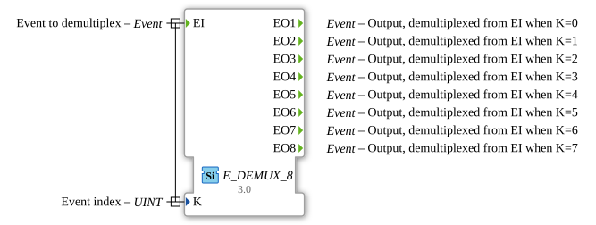

# E_DEMUX_8

<!-- Hier wäre Platz für ein Bild des Funktionsblocks, falls vorhanden. -->
* * * * * * * * * *

## Introduction

The `E_DEMUX_8` (Event Demultiplexer) is a function block according to IEC 61499 that forwards a single input event (`EI`) to one of eight outputs. The output selection is determined by the value of the input variable `K`.

## Interface Structure

### **Event Inputs**

- **EI (Event Input)**: The input event to be distributed.
- **Related Data**: `K`

### **Event Outputs**

- **EO1**: Triggered when `EI` arrives and `K = 0` is present.
- **EO2**: Triggered when `EI` arrives and `K = 1` is present.
- **EO3**: Triggered when `EI` arrives and `K = 2` is present.
- **EO4**: Triggered when `EI` arrives and `K = 3` is present.
- **EO5**: Triggered when `EI` arrives and is `K = 4`.
- **EO6**: Triggered when `EI` arrives and is `K = 5`.
- **EO7**: Triggered when `EI` arrives and is `K = 6`.
- **EO8**: Triggered when `EI` arrives and is `K = 7`.

### **Data Inputs**

- **K**: The zero-based selection index that determines which output is triggered (data type: `UINT`).

## Functionality

1. **Event Receipt**: The function block waits for an event at input `EI`.
2. **Selection**: When the `EI` event arrives, the value of the data variable `K` is evaluated.
3. **Forwarding**: The event is forwarded to output `EO(K+1)`. For example:

- If `K` = 0, the event is forwarded to `EO1`.
- If `K` = 7, the event is forwarded to `EO8`.
1. **Invalid Index**: If the value of `K` is outside the valid range [0, 7], no output event is triggered.

## Technical Features

- **1-to-8 Distribution**: This function block distributes an event across eight possible outputs.
- **Index-Driven**: The logic is based on a numeric index (`K`).
- **Confusing Naming Convention**: Note that the outputs are named 1-based (`EO1` to `EO8`), but the selection index `K` is 0-based (`K=0` for `EO1`, `K=7` for `EO8`, etc.).
- **Generic Block**: The functionality is provided by the generic class `GEN_E_DEMUX`.

## Application Scenarios

- **State Machines**: Selection of the next state transition from up to eight possibilities.
- **Mode Switching**: Activation of different system components depending on the selected operating mode.
- **Communication Router**: Forwards messages or commands to one of eight channels.

## 🛠️ Related Exercises

- [Exercise_006c](../../../Uebungen/test_B/Uebungen_doc/Uebung_006c.md)
- [Exercise_041](../../../Uebungen/test_B/Uebungen_doc/Uebung_041.md)

## Conclusion

The `E_DEMUX_8` is a useful implementation of the demultiplexer principle for use cases with up to eight different event paths. As with the other `E_DEMUX` blocks, the inconsistent naming of the outputs relative to the index value requires special attention during implementation.
