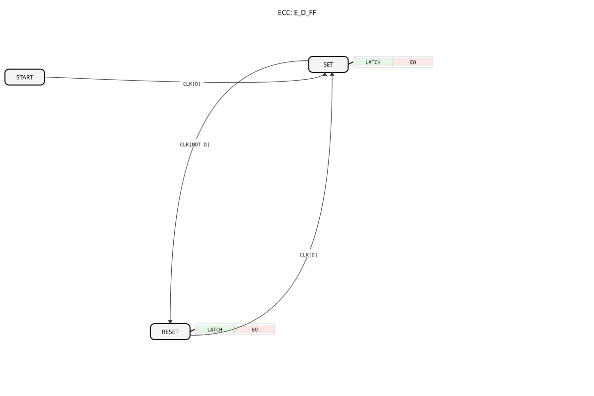

# E_D_FF
----

* * * * * * * * * *
## Introduction
IEC 61499 is an international standard for modeling distributed industrial control systems. The **E_D_FF** (Data Flip-Flop) is a fundamental memory element in this standard that stores digital signals synchronously with a clock signal. This functional block plays a central role in state machines and memory applications in industrial automation solutions.

## Structure of the E_D_FF Block

### Interface

**Event Inputs:**

- `CLK` (Clock): Clock event that triggers the transfer of the data input `D`.
- **Linked Data**: `D`

**Event Outputs:**

- `EO` (Event Output): Triggered when the `CLK` pulse results in a change to the output `Q`.
- **Linked Data**: `Q`

**Data Inputs:**

- `D`: The data value to be stored (data type: `BOOL`).

**Data Outputs:**

- `Q`: The currently stored value (data type: `BOOL`).

## Functionality

1. **Data Storage:**

- On each rising edge of the `CLK` signal, the value of `D` is transferred to `Q`.
- When the value changes, the `EO` event is triggered.

2. **Data Retention:**

- Between clock edges, the stored value `Q` remains stable.
- Changes at the `D` input have no effect without a clock edge.

## Technical Features

✔ **Clock-controlled storage** for synchronous systems
✔ **Event output** for change detection
✔ **Deterministic behavior** in real-time systems
✔ **Easy integration** into IEC 61499 applications

## Application Scenarios
- **State Storage** in Automation Processes
- **Input Buffering** for Operator Input
- **Edge Detection** in Signal Processing Chains
- **Synchronization** between Asynchronous System Components

## ⚖️ Comparison with Similar Function Blocks

| Feature | E_D_FF | E_SR | E_R_TRIG |
|----------------|-------|------|----------|
| Memory Type | D Flip-Flop | SR Latch | Edge Detector |
| Clocking | Required | None | None |
| Data Retention | Yes | Yes | No |
| Event Output | On Change | On Set/Reset | On Edge |

## 🛠️ Related Exercises
* [Exercise_071a](../../../Uebungen/test_B/Uebungen_doc/Uebung_071a.md)]
* [Exercise_071b](../../../Uebungen/test_B/Uebungen_doc/Uebung_071b.md)]
* [Exercise_072b](../../../Uebungen/test_B/Uebungen_doc/Uebung_072b.md)]
* [Exercise_085](../../../Uebungen/test_B/Uebungen_doc/Uebung_085.md)]

## Conclusion

The E_D_FF block represents an essential memory element for IEC 61499-based control systems. Its main advantages are:

- Reliable clock-synchronous data storage
- Immediate feedback of state changes
- Robust integration into distributed control architectures

Due to its simple yet effective functionality, it forms the basis for more complex memory and state controls in industrial automation solutions. Strict adherence to the IEC 61499 standards ensures seamless interoperability with other functional modules.
