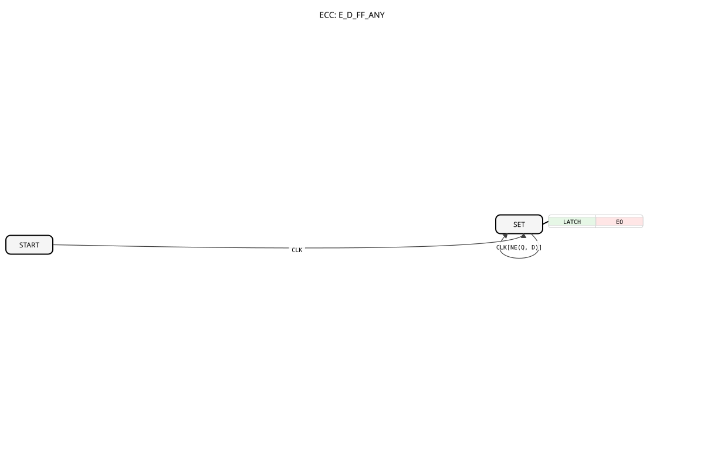

# E_D_FF_ANY

* * * * * * * * * *

## Introduction

`E_D_FF_ANY` is the generically-typed variant of `E_D_FF`: while `E_D_FF` only latches `BOOL` values, `E_D_FF_ANY` accepts an input `D` of data type `ANY` and can therefore be used as a clocked latch with built-in change detection for arbitrary data types (e.g. `TIME`, `DINT`, `REAL`, `STRING`).

## Interface Structure

### **Event Inputs**

- **CLK**: Clock event, latches the current value of `D`.
    - **Connected data**: `D`

### **Event Outputs**

- **EO**: Only triggered if `Q` actually changed as a result of the `CLK` pulse.
    - **Connected data**: `Q`

### **Data Inputs**

- **D** (ANY): The value to be latched, of arbitrary data type.

### **Data Outputs**

- **Q** (ANY): The last latched value, of the same data type as `D`.

## Functionality

On every `CLK` event, the ECC compares the new value `D` with the currently stored `Q` (`NE(Q, D)`). Only if the value has actually changed is `Q := D` executed and `EO` triggered — if the value is unchanged, the block remains in state `SET` without generating an event. The initial state `START` always latches the value unconditionally on the first `CLK`, regardless of change detection.

## Technical Features

- **ANY typing**: Unlike `E_D_FF` (fixed to `BOOL`), `E_D_FF_ANY` can be instantiated with any IEC 61131-3 data type the target environment supports for generic `ANY` adaptation.
- **Built-in change detection**: Unlike a plain latch, `E_D_FF_ANY` only triggers `EO` on an actual value change — this significantly reduces event load in downstream FB networks.
- **Basis for the `_TMIN` variants**: [E_D_FF_ANY_TMIN](E_D_FF_ANY_TMIN.md) additionally combines this block with a minimum spacing time between two `EO` events.

## State Overview

| State | Meaning |
|---|---|
| START | Initial state, first `CLK` unconditionally latches `D` |
| SET | `Q` holds the last latched value; further `CLK` events only trigger `EO` again if `NE(Q, D)` |

## Application Scenarios

- **Change-driven downstream processing of arbitrary data types**: A `TIME` or `REAL` value should only trigger a follow-up event if it actually changed — e.g. as a building block inside composite FBs such as `ATM_SUB` (see the `adapter` library), which combines `F_MOVE` + `E_D_FF_ANY` for explicit, FBNetwork-visible change detection.
- **Generic caching**: Buffering an arbitrary value with notification only on a genuine change, independent of the concrete data type.

## Comparison with similar function blocks

- **`E_D_FF`**: functionally identical, but fixed to `BOOL`.
- **[E_D_FF_ANY_TMIN](E_D_FF_ANY_TMIN.md)**: the same functionality, additionally with a minimum spacing time between `EO` events.
- **[E_D_FF_TMIN](E_D_FF_TMIN.md)**: the `BOOL` variant with a minimum spacing time.

## Conclusion

`E_D_FF_ANY` provides a generically-typed, change-detecting latch and is a central building block wherever composite FBs for arbitrary data types need to trigger an event only on an actual value change.
