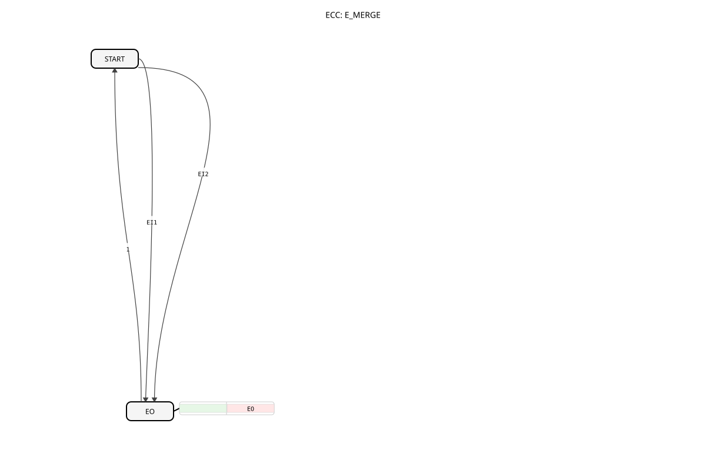

# E_MERGE

* * * * * * * * * *

## Introduction

The **E_MERGE** is a fundamental function block of the IEC 61499 standard that combines multiple event streams into a single output. This logical OR operation of events is essential for control logic in industrial automation systems.

## Structure of the E_MERGE Block

### Interface

**Event Inputs:**

- `EI1` (Event Input 1): First event input
- `EI2` (Event Input 2): Second event input

**Event Outputs:**

- `EO` (Event Output): Merged event output

## Functionality

1. **Event Merging:**

- Each event at `EI1` or `EI2` triggers an output event at `EO`
- The inputs are logically ORed
1. **Independent Processing:**

- Events at both inputs are Equal treatment
- No prioritization of specific inputs
1. **Immediate forwarding:**

- No delay between input and output events
- No memory behavior or state maintenance

## Technical Features

✔ **Simple and fast** event linking
✔ **Lossless** event forwarding
✔ **Real-time capable** for industrial applications
✔ **Expandable** to multiple inputs

## Application Scenarios

- **Operating concepts**: Combining control signals from multiple buttons
- **Sensor data**: Combining events from different sensors
- **Fault management**: Central location for various fault messages
- **Process control**: Linking process events

## ⚖️ Comparison with similar function blocks

| Feature | E_MERGE | E_DEMUX | E_SWITCH |
| --------------- | --------- | --------- | --------- |
| Functional principle | OR operation | Distribution | Conditional forwarding |
| Direction | n:1 | 1:n | 1:1 |
| Event flow | Combination | Splitting | Selection |

## Similar Building Blocks

For use cases requiring more than two event inputs, the library provides additional variants:

- **E_MERGE**: This building block (2 inputs)
- **E_MERGE_2**: Functionally identical to `E_MERGE` (2 inputs)
- **E_MERGE_3**: A variant with 3 inputs (`EI1`, `EI2`, `EI3`)
- **E_MERGE_4**: A variant with 4 inputs

These building blocks allow for the easy merging of up to four event sources into a single output.

## 🛠️ Related Exercises

- [Exercise_004a2](../../../Uebungen/test_B/Uebungen_doc/Uebung_004a2.md)
- [Exercise_004a2_AX](../../../Uebungen/test_AX/Uebungen_doc/Uebung_004a2_AX.md)

## Conclusion

The E_MERGE block is a fundamental building block for event processing in IEC 61499 systems. Its main advantages are:

- Simple and efficient event combination
- Immediate response to input events
- Flexible application possibilities in various control scenarios

Due to its clear functionality and standard compliance, it is ideally suited for basic logic tasks in industrial automation solutions. Its deterministic operation makes it particularly valuable for safety-critical applications.
