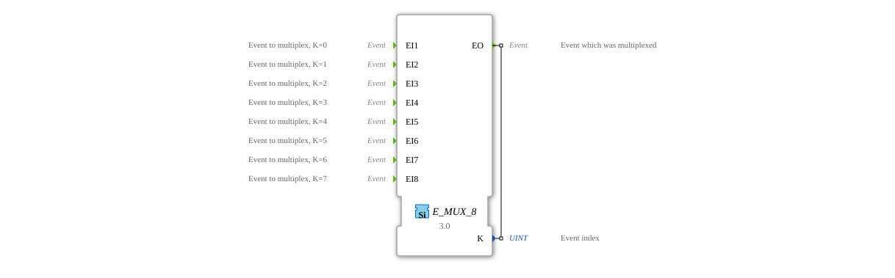

# E_MUX_8

<!-- Hier wäre Platz für ein Bild des Funktionsblocks, falls vorhanden. -->
* * * * * * * * * *
## Introduction

The `E_MUX_8` (Event Multiplexer) is a function block according to IEC 61499 that combines eight event inputs (`EI1` to `EI8`) into a single event output (`EO`). In addition to combining the inputs, the block outputs a data output, `K`, indicating which input triggered the event. It is the counterpart to the `E_DEMUX_8`.

## Interface Structure

### **Event Inputs:**

- **EI1 ... EI8**: The eight separate input channels.

### **Event Outputs:**

- **EO (Event Output)**: The common event output.
- **Associated Data**: `K`

### **Data Outputs:**

- **K**: The index of the triggering input channel (data type: `UINT`).
- `K = 0` if `EI1` was triggered.
- `K = 1` if `EI2` was triggered.
- ...
- `K = 7` when `EI8` is triggered.

## Functionality

1. **Event Reception**: The function block waits for an event at one of its eight inputs.
2. **Forwarding and Identification**: When an event arrives at `EIn` (where `n` represents 1 to 8), the data output `K` is set to `n-1`, and the `EO` event is immediately triggered.

In this way, the event streams are merged while preserving information about the event's origin.

## Technical Features

- **8-to-1 Multiplexer**: Combines eight event streams into one.
- **Origin Index**: Indicates which input triggered the event.
- **Stateless**: The function block has no internal memory.
- **Generic Function Block**: The functionality is provided by the generic class `GEN_E_MUX`.

## Application Scenarios

- **Keyboard Matrix**: Groups the signals from eight keys into a central evaluation logic.
- **Comprehensive Alarming**: Groups eight different alarms into a central routine, which then processes the specific alarm message based on `K`.
- **Prioritized Command Selection**: Eight command sources are combined, and downstream logic determines the priority based on the index `K`.

## 🛠️ Related Exercises

* [Exercise_173](../../../Uebungen/test_B/Uebungen_doc/Uebung_173.md)

## Conclusion

The `E_MUX_8` is a useful component for bundling event streams from up to eight sources while simultaneously identifying the event's source. It is the standard counterpart to the `E_DEMUX_8` and is frequently used to reduce wiring complexity and centralize logic.
