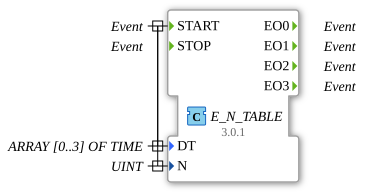

# E_N_TABLE

* * * * * * * * * *
## Introduction
The `E_N_TABLE` (Event N-Table) is a function block according to IEC 61499 that generates a finite sequence of time-staggered events on separate outputs. Internally, it combines a table-controlled timer (`E_TABLE`) with a demultiplexer (`E_DEMUX`) to create a chain of events, with each event output on its own channel.

## Interface Structure

### **Event Inputs**
- **START**: Starts the generation of the event sequence.
- **Related Data**: `DT`, `N`
- **STOP**: Stops the sequence prematurely.

### **Event Outputs**
- **EO0**: Outputs the first event of the sequence (index 0).
- **EO1**: Outputs the second event of the sequence (index 1).
- **EO2**: Outputs the third event of the sequence (index 2).
- **EO3**: Outputs the fourth event of the sequence (index 3).

### **Data Inputs**
- **DT**: An array of durations (data type: `TIME`, size: 4). `DT[i]` defines the delay time to wait *before* the `i`-th event.
- **N**: The total number of events to be generated (data type: `UINT`, max. 4 for this function block).

## Functionality

1. **Start of sequence**: A `START` event triggers the internal `E_TABLE` function block. The number of events to be generated is determined by `N`.

2. **First event**: The function block waits for the time interval defined in `DT[0]`. Then, the first event is triggered at output `EO0`.

3. **Subsequent Events**: The function block waits for the time interval defined in `DT[1]` and then triggers the second event at `EO1`. This process repeats for the next events according to the durations in `DT[2]`, `DT[3]`, and so on, until `N` events have been generated.

4. **End of Sequence**: The sequence ends automatically after `N` events have been triggered.

5. **Stop**: A `STOP` event immediately terminates the sequence at any point.

**Example:**

- `N` = 3
- `DT` = `[T#2s, T#5s, T#1s]`
- After a `START` event:

1. After 2 seconds, `EO0` is triggered.

2. 5 seconds later, `EO1` is triggered.

3. 1 second later, `EO2` is triggered.

4. The sequence is complete. `EO3` is not triggered.

## Technical Features
- **Sequence Generator**: Generates a chain of individual, time-staggered events.
- **Demultiplexing**: Each event in the chain is routed to its own dedicated output.
- **Table-driven**: The time intervals between events are not fixed but are read from the `DT` array.

## Application Scenarios
- **Control of step sequences**: Each output (`EO0`, `EO1`, ...) can trigger a subsequent step in a process chain.
- **Complex control**: Controlling various actuators in a precisely defined temporal sequence (e.g., valves in a rinsing process).
- **Test automation**: Generating a complex, time-defined stimulus sequence for a test object.

## 🛠️ Related Exercises
* [Exercise_093b](../../../Uebungen/test_B/Uebungen_doc/Uebung_093b.md)

## Conclusion
The `E_N_TABLE` is a powerful building block for generating complex, time-defined event sequences. Unlike a simple `E_CYCLE`, which only generates a periodic clock signal, `E_N_TABLE` allows the definition of variable time intervals and the distribution of individual sequence events across separate channels. This makes it ideal for controlling sequential processes.
