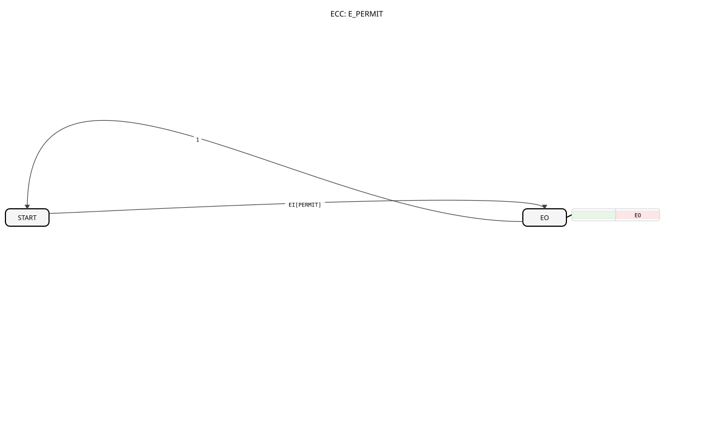

# E_PERMIT

## 🎧 Podcast

* [The E_PERMIT block: The "gatekeeper" for events in IEC 61499 systems decoded]
* [Decoding E_PERMIT: The Unsung Hero of Industrial Automation's Safety and Reliability]

## Introduction
The E_PERMIT (Event Permit) is a fundamental function block according to IEC 61499 that acts as a controllable "gate" for events. It allows an input event to pass to the output only if an explicit enable condition is met.

## Interface Structure

### **Event Inputs:**

- **EI (Event Input)**: The input event to be checked.

- **Associated Data**: `PERMIT`

### **Event Outputs:**

- **EO (Event Output)**: The event output, which is only triggered if permission has been granted.

### **Data Inputs:**

- **PERMIT**: The permission condition (data type: `BOOL`).

## Functionality

1. **Event Reception**: The function block waits for an event at input `EI`.

# 2. **Release Check**: When the `EI` event occurs, the value of the data variable `PERMIT` is evaluated.

3. **Conditional Forwarding**:

- **If `PERMIT` = `TRUE`**: The event is allowed through and output at `EO`.

- **If `PERMIT` = `FALSE`**: The event is blocked, and nothing happens. Output `EO` is not triggered.

This function block thus acts as a simple monitor for the event flow.

## Technical Features

- **Event Gate**: Serves as a fundamental "gate" for controlling event flows.

- **Stateless**: The function block itself has no internal memory; its decision is based solely on the value of `PERMIT` at the moment of the `EI` event.

## Application Scenarios

- **Allowances/Interlocks**: A process step (`EI`) may only be started if a safety allow (`PERMIT`) is present (e.g., safety door closed).

- **Operating Mode Switching**: Commands from a manual controller (`EI`) are only forwarded if the system is in "Manual" mode (`PERMIT` = true).

- **Data Validation**: An event that triggers further data processing is only triggered if a previous data validation was successful (`PERMIT` = true).

## ⚖️ Comparison with Similar Building Blocks

- **`E_SWITCH`**: While `E_PERMIT` either passes or blocks an event (1-to-1 or 1-to-0), `E_SWITCH` forwards an event to one of two different outputs (1-to-2). `E_PERMIT` is a gate, and `E_SWITCH` is a switch.

## 🛠️ Related Exercises

* [Exercise_009](../../../Uebungen/test_B/Uebungen_doc/Uebung_009.md)]

* [Exercise_080c](../../../Uebungen/test_B/Uebungen_doc/Uebung_080c.md)]

* [Exercise_094](../../../Uebungen/test_B/Uebungen_doc/Uebung_094.md)]

## Conclusion
The `E_PERMIT` block is a fundamental and widely used block for implementing conditions and enable statements in the event-driven logic of IEC 61499. Its simplicity and clear function make it an indispensable tool for creating safe and robust control sequences.