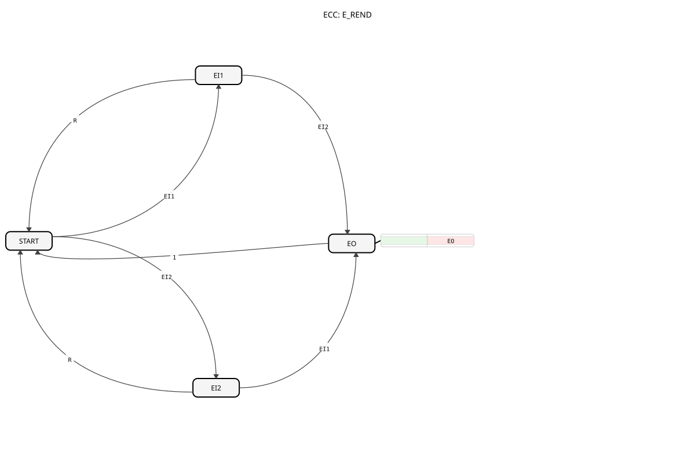

# E_REND

## 🎧 Podcast

* [E_REND: Event Synchronization in IEC 61499](https://podcasters.spotify.com/pod/show/iec-61499-grundkurs-de/episodes/E_REND-Ereignissynchronisation-in-IEC-61499-e368co9)
* [E_REND: Event Synchronization in IEC 61499](https://podcasters.spotify.com/pod/show/iec-61499-prime-course-en/episodes/E_REND-Event-Synchronization-in-IEC-61499-e368cv2)
## Introduction

The `E_REND` (Event Rendezvous) is a function block according to IEC 61499 that serves as a synchronization point for two different event streams. It only fires an output event when it has received at least one event from each of its inputs. This corresponds to a logical AND operation over time.

## Interface Structure

### **Event Inputs:**

- **EI1**: The first event input.
- **EI2**: The second event input.
- **R (Reset)**: Resets the function block to its initial state.

### **Event Outputs:**

- **EO (Event Output)**: Triggered after both `EI1` and `EI2` have been received at least once since the last reset.

## Functionality

1. **Waiting for Events**: In its initial state, the function block waits for events at `EI1` and `EI2`.
2. **Store the First Event**: When an event arrives at the first input (e.g., `EI1`), the function block stores this internally and then waits for the event at the second input (`EI2`).
3. **Rendezvous and Triggering**: As soon as the second event (`EI2`) arrives, the "rendezvous" condition is met. The function block immediately triggers the output event `EO`.
4. **Automatic Reset**: Immediately after `EO` is triggered, the function block automatically resets to its initial state and waits for the next pair of events, `EI1` and `EI2`.
5. **External Reset**: An event at the `R` input resets the function block to its initial state at any time, discarding all previously recorded but incomplete event pairs.

**Important**: The input events `EI1` and `EI2` do **not** have to arrive simultaneously. The order in which they arrive is also irrelevant.

## Technical Features

- **Static**: Unlike a `E_MERGE` (OR), `E_REND` has an internal state to remember the arrival of the first event.
- **Synchronization**: Used to synchronize two asynchronous event flows.

## Application Scenarios

- **Process Synchronization**: A subsequent process step (`EO`) may only start when two independent preconditions are met (e.g., "Component clamped" (`EI1`) and "Safety door closed" (`EI2`)).
- **Acknowledgement**: An action is only executed when both a command (`EI1`) and manual acknowledgement by an operator (`EI2`) are present.
- **Material Flow**: A conveyor belt stops (`EO`) when both the front and rear sensors have detected a long component.

## 🛠️ Related Exercises

* [Exercise_004a6](../../../Uebungen/test_B/Uebungen_doc/Uebung_004a6.md)]
* [Exercise_004a6_AX](../../../Uebungen/test_AX/Uebungen_doc/Uebung_004a6_AX.md)]
* [Exercise_004a7](../../../Uebungen/test_B/Uebungen_doc/Uebung_004a7.md)]
* [Exercise_004a7_AX](../../../Uebungen/test_AX/Uebungen_doc/Uebung_004a7_AX.md)]
* [Exercise_025](../../../Uebungen/test_B/Uebungen_doc/Uebung_025.md)]
* [Exercise_026](../../../Uebungen/test_B/Uebungen_doc/Uebung_026.md)]

## Conclusion

The `E_REND` block is a critical tool for process synchronization in IEC 61499. It provides a robust method to ensure that multiple conditions are met before a subsequent action is triggered. Its ability to "remember" the arrival of events makes it significantly more powerful than simple logical connections and is fundamental for controlling asynchronous and parallel processes.
