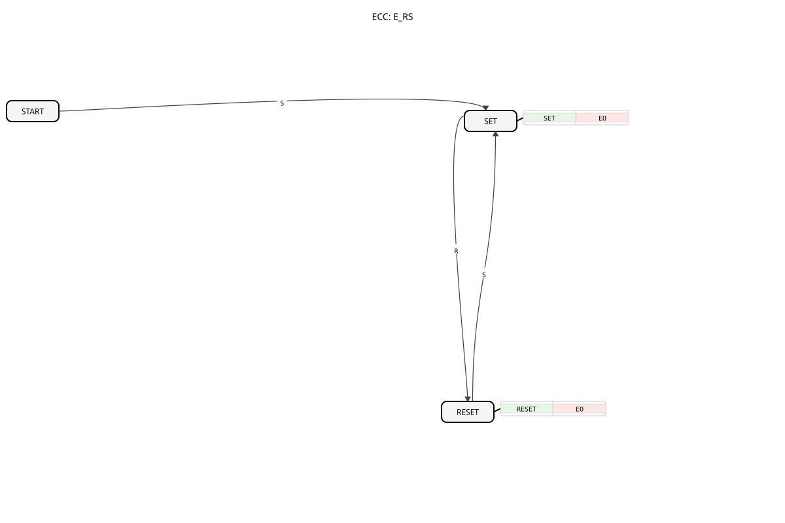

# E_RS

## Introduction

The `E_RS` (Event-driven RS Flip-Flop) is an event-driven, bistable function block according to IEC 61499. It serves as a basic memory element controlled by separate "Set" and "Reset" events. Its output `Q` retains its state until an opposing event occurs.

## Interface Structure

### **Event Inputs:**

- **S (Set)**: Sets the output `Q` to `TRUE`.
- **R (Reset)**: Sets the output `Q` to `FALSE`.

### **Event Outputs:**

- **EO (Event Output)**: Triggered when the state of `Q` changes.
- **Associated Data**: `Q`

### **Data Outputs:**

- **Q**: The current state of the flip-flop (data type: `BOOL`).

## Functionality

The `E_RS` block functions as a simple latch:

1. **Set**: When an event arrives at the input `S`, the output `Q` is set to `TRUE`. If `Q` was previously `FALSE`, the `EO` event is triggered.
2. **Reset**: When an event arrives at the input `R`, the output `Q` is set to `FALSE`. If `Q` was previously `TRUE`, the `EO` event is triggered.
3. **Save**: Between events, `Q` retains its last set state.

## Technical Features and Standards Comparison

According to **DIN EN 61499-1 (Table A.1, Note 8)**, the implementation of this function block is identical to [E_SR](E_SR.md). Both function blocks (`E_RS` and `E_SR`) exist to maintain consistency with the types in IEC 61131-3, even though IEC 61499 does not have an inherent "dominance" of events, as is the case with level-controlled inputs in classic PLC programming.

- **Comparison to IEC 61131-3**: See [RS (Bistable, priority reset)](../../Vergleich/IEC61131_3/RS_ALT.md). While in IEC 61131-3 the `RS` function block has a defined "reset dominance" (if R and S are TRUE simultaneously, R wins), the behavior in IEC 61499 for closely spaced events depends on the processing order of the runtime environment (ECC). Since events are transient, there is no permanent conflict between two static signals.
- **Functional Identity**: `E_RS` and `E_SR` are technically identical. Their graphical representation and naming conventions simply follow the established naming conventions to facilitate orientation for developers.
- **Change Detection**: The `EO` output is only triggered by an actual state change.

## Application Scenarios

- **Start/Stop Logic**: A "Start" button is connected to `S`, and a "Stop" button to `R`, to control the state of a machine.
- **Start/Stop Logic**: - **Error Storage**: An error event sets the function block (`S`), which stores the error state until it is explicitly acknowledged by an operator or another process (`R`).
- **Mode Storage**: Stores the current operating mode of a system (e.g., "Manual" vs. "Automatic").

## Related Function Blocks

- **[E_SR](E_SR.md)**: Functionally identical to `E_RS`, with the inputs in the symbol swapped.
- **`E_D_FF`**: Clock-based storage (Data Latch). `E_D_FF` takes the value at the `D` input on a `CLK` event.

## 🛠️ Related Exercises

- [Exercise_006b](../../../Uebungen/test_B/Uebungen_doc/Uebung_006b.md)
- [Exercise_020a](../../../Uebungen/test_B/Uebungen_doc/Uebung_020a.md)
- [Exercise_020b](../../../Uebungen/test_B/Uebungen_doc/Uebung_020b.md)
- [Exercise_020d](../../../Uebungen/test_B/Uebungen_doc/Uebung_020d.md)

## Conclusion

The `E_RS` block is a fundamental memory block in IEC 61499. It is ideal for simple state storage where a state is set by one event and explicitly reset by another. The lack of guaranteed set or reset dominance for simultaneous events must be considered in critical applications.
