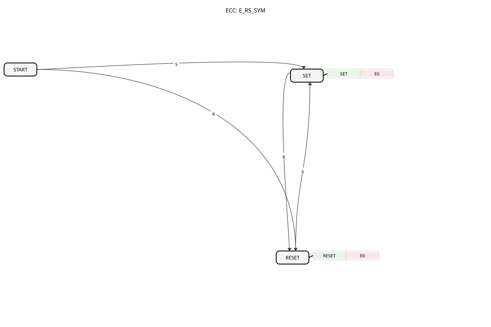

# E_RS_SYM

* * * * * * * * * *

## Introduction

`E_RS_SYM` (Event-driven RS Flip-Flop, symmetric start-up behaviour) is an event-driven, bistable memory element according to IEC 61499. It behaves functionally like [E_RS](../E_RS.md)/[E_SR](../E_SR.md), but differs in its initial state: while `E_RS`/`E_SR` only produce a defined output after the first `S` or `R` event, `E_RS_SYM` already reacts symmetrically to both events in its initial state `START` and immediately transitions into the matching `SET` or `RESET` state.

## Interface Structure

### **Event Inputs**

- **S (Set)**: Sets output `Q` to `TRUE`.
- **R (Reset)**: Sets output `Q` to `FALSE`.

### **Event Outputs**

- **EO (Event Output)**: Triggered after every `S` or `R` event.
    - **Connected data**: `Q`

### **Data Outputs**

- **Q**: The current state of the flip-flop (data type: `BOOL`).

## Functionality

The ECC has three states: `START`, `SET`, and `RESET`. From `START`, both an `S` and an `R` event lead to a defined follow-up state (`SET` or `RESET`) — unlike `E_RS`, where `START` only reacts to one of the two events and the other has no effect initially. From `SET` and `RESET`, the block behaves like a classic RS flip-flop: `R` switches from `SET` to `RESET`, `S` from `RESET` to `SET`. Every state change runs the `SET` (`Q := TRUE`) or `RESET` (`Q := FALSE`) algorithm and triggers `EO`.

## Technical Features

- **Symmetric start-up behaviour**: The key difference to `E_RS`/`E_SR` lies in the `START` state: both input events (`S` and `R`) lead to a defined transition there, so a correct `Q` value is set regardless of which event arrives first after startup.
- **No init mechanism**: Unlike [E_RS_SYM_INIT](E_RS_SYM_INIT.md), this block has no `INIT`/`INITO` interface; the start state results solely from the first `S` or `R` event received.

## State Overview

| State | Meaning |
| --- | --- |
| START | Initial state, waits symmetrically for `S` or `R` |
| SET | `Q = TRUE`, reachable from `START` (via `S`) or `RESET` (via `S`) |
| RESET | `Q = FALSE`, reachable from `START` (via `R`) or `SET` (via `R`) |

## Application Scenarios

- **Start/stop logic with a guaranteed initial state**: Wherever it is unpredictable after an application restart whether a set or a reset signal arrives first, but a correct `Q` value is still required immediately.
- **Fault storage**: Like `E_RS`, but with the additional guarantee that even a first `R` event (e.g., an acknowledgment before the first fault) correctly results in `Q = FALSE`.

## Comparison with similar function blocks

- **[E_RS](../E_RS.md) / [E_SR](../E_SR.md)**: functionally nearly identical, but without symmetric start-up behaviour — in the initial state only one of the two events has an effect.
- **[E_RS_SYM_INIT](E_RS_SYM_INIT.md)**: the same base functionality, extended with an explicit `INIT`/`INITO` interface for setting a defined start value.
- **[E_SR_SYM](E_SR_SYM.md)**: functionally identical, only the order of `S`/`R` in the interface definition is swapped (naming convention analogous to `E_RS`/`E_SR`).

## Conclusion

`E_RS_SYM` provides a bistable memory element with guaranteed, well-defined behaviour from the very first event received, making it suitable wherever the initial-state behaviour of `E_RS`/`E_SR` is insufficient.
