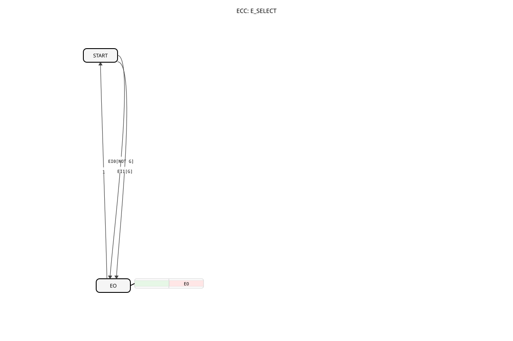

# E_SELECT

* * * * * * * * * *

## Introduction

The **E_SELECT** is a basic function block according to IEC 61499 (Annex A) that enables the conditional forwarding of events based on a control signal. The current version 1.0 is licensed under EPL-2.0.

## Interface Structure

### **Event Inputs**

- `EI0`: Input event (passed on if G=0)
- `EI1`: Input event (passed on if G=1)

### **Event Outputs**

- `EO`: Output event (passed on)

### **Data Inputs**

- `G` (BOOL): Control signal for selection:
- G=0: Pass on EI0
- G=1: Pass on EI1

## Functionality

1. **Event Processing**:

- Upon input of EI0 or EI1, the G-value is evaluated.
- Only the event matching the G-value is passed on.
1. **State Machine** (ECC):

- **START**: Wait state
- **EO**: Output state (with EO action)
- Transitions:
- EI0 at G=0 → EO
- EI1 at G=1 → EO
- Always returns to START
1. **Execution Logic**:

- Deterministic event selection
- No buffering of events

## Technical Features

✔ **Boolean control** of event selection
✔ **Real-time processing**

✔ **State-based implementation (BasicFB)
✔ **EPL 2.0 Open-Source** implementation

## Application Scenarios

- **Branched Process Control**: Alternative execution paths
- **Mode Switching**: Operating mode change
- **Error Handling**: Alternative error routines
- **Test Automation**: Switching between test and normal operation

## ⚖️ Comparison with similar function blocks

| Feature | E_SELECT | E_SWITCH | E_MERGE |
| --------------- | ---------- | ---------- | ---------- |
| Selection Criterion | Boolean (`G`) | Boolean (`G`) | None |
| Direction | 2:1 (Multiplexer) | 1:2 (Demultiplexer) | n:1 (OR Gate) |
| State Model | BasicFB | BasicFB | BasicFB/Generic |

## 🛠️ Related Exercises

- [Exercise_095](../../../Uebungen/test_B/Uebungen_doc/Uebung_095.md)

## Conclusion

The E_SELECT function block offers a robust solution for event-based control decisions:

- Simple yet effective selection
- Clear state machine implementation
- Standards-compliant interface

Due to its deterministic operation, it is particularly suitable for safety-critical applications and complex control logic. Its use as a BasicFB also enables integration into all IEC 61499-compliant development environments.

See also: [https://www.holobloc.com/doc/fb/rt/events/E_SELECT.htm](https://www.holobloc.com/doc/fb/rt/events/E_SELECT.htm)
