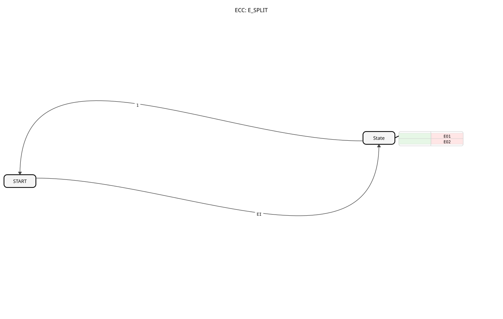

# E_SPLIT (Event Distributor)

* * * * * * * * * *
## Introduction
The **E_SPLIT** is a standards-compliant function block (IEC 61499-1 Annex A) for event distribution, developed under the EPL 2.0 license. Version 1.0 splits an incoming event sequentially into two output events.

## Interface Structure

### **Event Input**
- `EI`: Input event (trigger for distribution)

### **Event Outputs**
- `EO1`: First output event
- `EO2`: Second output event

## Functionality

1. **Event Receipt**:

- Upon receipt of `EI`, the state machine is activated.

2. **Sequential Processing**:

- **START State**: Waits for input event.
- **STATE State**:
- Executes action `EO1` (immediately).
- Executes action `EO2`. (Immediately after)
- Automatic return to START

3. **Execution Order**:

- Guaranteed sequence: EI → EO1 → EO2
- Deterministic timing

## Technical Features

✔ **Strict Sequencing** (EO1 before EO2)

✔ **State-based Implementation** (BasicFB)
✔ **Real-time event processing**

✔ **EPL 2.0 Open-Source** Implementation

## Application Scenarios
- **Flow Control**: Clocked process steps
- **Device Control**: Activation sequences
- **Security Systems**: Delayed emergency routines
- **Test Automation**: Triggers for test sequences

## ⚖️ Comparison with similar building blocks

| Feature | E_SPLIT | E_DEMUX | E_MERGE |
|---------------|---------|---------|---------|
| Functional principle | 1:2 sequence | 1:n distribution | n:1 combination |
| Event sequence | Fixed | Address-dependent | Arbitrary |
| State model | BasicFB | Variable | None |

## 🛠️ Related Exercises

* [Exercise_004a4](../../../Uebungen/test_B/Uebungen_doc/Uebung_004a4.md)]
* [Exercise_004a4_AX](../../../Uebungen/test_AX/Uebungen_doc/Uebung_004a4_AX.md)]
* [Exercise_080b](../../../Uebungen/test_B/Uebungen_doc/Uebung_080b.md)]

## Conclusion

The E_SPLIT block offers a reliable solution for sequential event distribution:

- Guaranteed event sequence
- Simple yet effective functionality
- Robust state machine model

Due to its deterministic operation, it is particularly suitable for time-critical control tasks and safety-related applications. Its standards-compliant implementation enables seamless integration into IEC 61499-based systems.
