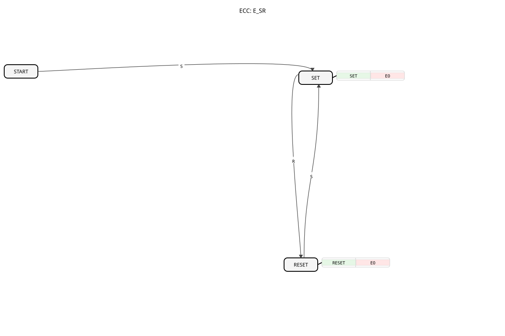

# E_SR

## 🎧 Podcast

- [IEC 61499: The E_SR Function Block Decoded – Simplicity Meets Event Control ](https://podcasters.spotify.com/pod/show/iec-61499-grundkurs-de/episodes/IEC-61499-Der-E_SR-Baustein-entschlsselt--Einfachheit-trifft-Ereignissteuerung-e3682bo)
- [Decoding the E_SR Function Block: The Unsung Hero of Industrial Automation ](https://podcasters.spotify.com/pod/show/iec-61499-prime-course-en/episodes/Decoding-the-E_SR-Function-Block-The-Unsung-Hero-of-Industrial-Automation-e3681qo)
## Introduction

The `E_SR` (Event-driven SR Flip-Flop) is an event-driven, bistable function block according to IEC 61499. It serves as a basic memory element controlled by separate "Set" and "Reset" events. Its output, `Q`, retains its state until an opposing event occurs.

## Interface Structure

### **Event Inputs:**

- **S (Set)**: Sets the output `Q` to `TRUE`.
- **R (Reset)**: Sets the output `Q` to `FALSE`.

### **Event Outputs:**

- **EO (Event Output)**: Triggered when the state of `Q` changes.
- **Associated Data**: `Q`

### **Data Outputs:**

- **Q**: The current state of the flip-flop (data type: `BOOL`).

## Functionality

The `E_SR` block functions as a simple latch:

1. **Set**: When an event arrives at the input `S`, the output `Q` is set to `TRUE`. If `Q` was previously `FALSE`, the `EO` event is triggered.
2. **Reset**: When an event arrives at the input `R`, the output `Q` is set to `FALSE`. If `Q` was previously `TRUE`, the `EO` event is triggered.
3. **Save**: Between events, `Q` retains its last set state.

## Technical Features and Standards Comparison

According to **DIN EN 61499-1 (Table A.1, Note 8)**, the implementation of this function block is identical to [E_RS](E_RS.md). Both function blocks (`E_SR` and `E_RS`) exist to maintain consistency with the types in IEC 61131-3, even though IEC 61499 does not have an inherent "dominance" of events, as is the case with level-controlled inputs in classic PLC programming.

- **Comparison to IEC 61131-3**: See [SR (Bistable, set first)](../../Vergleich/IEC61131_3/SR_ALT.md). While in IEC 61131-3 the `SR` function block has a defined "set dominance" (if S and R are TRUE simultaneously, S wins), in IEC 61499 the behavior with closely spaced events depends on the processing order of the runtime environment (ECC). Since events are transient, there is no permanent conflict between two static signals.
- **Functional Identity**: `E_SR` and `E_RS` are technically identical. Their graphical representation and naming conventions simply follow established naming conventions to aid developers.
- **Change Detection**: The `EO` output is only triggered by an actual state change.

## Application Scenarios

- **Start/Stop Logic**: A "Start" button is connected to `S`, and a "Stop" button to `R`, to control the state of a machine.
- **Start/Stop Logic**: - **Error Storage**: An error event sets the function block (`S`), which stores the error state until it is explicitly acknowledged by an operator or another process (`R`).
- **Mode Storage**: Stores the current operating mode of a system (e.g., "Manual" vs. "Automatic").

## Related Function Blocks

- **[E_RS](E_RS.md)**: Functionally identical to `E_SR`. The only difference is the graphical arrangement of the `S` and `R` connections on the symbol.
- **`E_D_FF`**: Also stores a state, but on a clock-based basis. `E_D_FF` takes the value from the `D` input when a `CLK` event occurs.

E_D_FF`
## 🛠️ Related exercises

- [Uebung_004b](../../../Uebungen/test_B/Uebungen_doc/Uebung_004b.md)
- [Uebung_004b2](../../../Uebungen/test_B/Uebungen_doc/Uebung_004b2.md)
- [Uebung_004b3](../../../Uebungen/test_B/Uebungen_doc/Uebung_004b3.md)
- [Uebung_006](../../../Uebungen/test_B/Uebungen_doc/Uebung_006.md)
- [Uebung_006c](../../../Uebungen/test_B/Uebungen_doc/Uebung_006c.md)
- [Uebung_006d](../../../Uebungen/test_B/Uebungen_doc/Uebung_006d.md)
- [Uebung_007a3](../../../Uebungen/test_B/Uebungen_doc/Uebung_007a3.md)
- [Uebung_008](../../../Uebungen/test_B/Uebungen_doc/Uebung_008.md)
- [Uebung_009](../../../Uebungen/test_B/Uebungen_doc/Uebung_009.md)
- [Uebung_013](../../../Uebungen/test_B/Uebungen_doc/Uebung_013.md)
- [Uebung_014](../../../Uebungen/test_B/Uebungen_doc/Uebung_014.md)
- [Uebung_015](../../../Uebungen/test_B/Uebungen_doc/Uebung_015.md)
- [Uebung_016](../../../Uebungen/test_B/Uebungen_doc/Uebung_016.md)
- [Uebung_019b](../../../Uebungen/test_B/Uebungen_doc/Uebung_019b.md)
- [Uebung_019c](../../../Uebungen/test_B/Uebungen_doc/Uebung_019c.md)
- [Uebung_021](../../../Uebungen/test_B/Uebungen_doc/Uebung_021.md)
- [Uebung_022](../../../Uebungen/test_B/Uebungen_doc/Uebung_022.md)
- [Uebung_023](../../../Uebungen/test_B/Uebungen_doc/Uebung_023.md)
- [Uebung_024](../../../Uebungen/test_B/Uebungen_doc/Uebung_024.md)
- [Exercise_025](../../../Uebungen/test_B/Uebungen_doc/Uebung_025.md)
- [Exercise_026_sub](../../../Uebungen/test_B/Uebungen_doc/Uebung_026_sub.md)
- [Exercise_039a_sub_Outputs](../../../Uebungen/test_B/Uebungen_doc/Uebung_039a_sub_Outputs.md)
- [Exercise_160b](../../../Uebungen/test_B/Uebungen_doc/Uebung_160b.md)

## Conclusion

The `E_SR` block is a fundamental memory block in IEC 61499. It is ideal for simple state storage where a state is set by one event and explicitly reset by another. The lack of guaranteed set or reset dominance for simultaneous events must be considered in critical applications.
