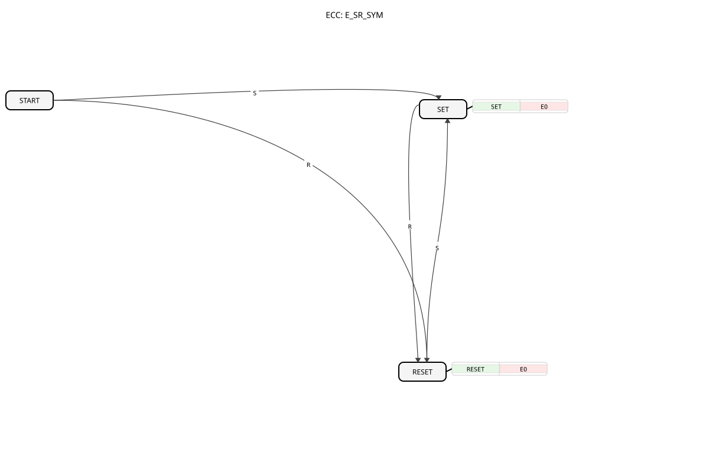

# E_SR_SYM

* * * * * * * * * *

## Introduction

`E_SR_SYM` (Event-driven SR Flip-Flop, symmetric start-up behaviour) is functionally identical to [E_RS_SYM](E_RS_SYM.md) — both blocks exist, analogous to [E_RS](E_RS.md)/[E_SR](E_SR.md), purely to preserve the IEC 61131-3 naming convention (`SR` = named set-first, `RS` = named reset-first), even though IEC 61499 has no true dominance between events.

## Interface Structure

### **Event Inputs**

- **S (Set)**: Sets output `Q` to `TRUE`.
- **R (Reset)**: Sets output `Q` to `FALSE`.

### **Event Outputs**

- **EO (Event Output)**: Triggered after every `S` or `R` event.
    - **Connected data**: `Q`

### **Data Outputs**

- **Q**: The current state of the flip-flop (data type: `BOOL`).

## Functionality

Identical to [E_RS_SYM](E_RS_SYM.md): the ECC has the states `START`, `SET`, and `RESET`. Already in state `START`, both `S` and `R` lead to a defined follow-up state. From `SET`/`RESET`, `R` switches to `RESET`, `S` to `SET`. Every transition sets `Q` accordingly and triggers `EO`.

## Technical Features

- **Functionally identical to `E_RS_SYM`**: The graphical representation and naming (`S` before `R` in the interface) follows the IEC 61131-3 convention but has no effect on actual behaviour.
- **Symmetric start-up behaviour**: As with `E_RS_SYM`, the initial state already reacts in a well-defined way to both events.

## State Overview

| State | Meaning |
| --- | --- |
| START | Initial state, waits symmetrically for `S` or `R` |
| SET | `Q = TRUE` |
| RESET | `Q = FALSE` |

## Application Scenarios

See [E_RS_SYM](E_RS_SYM.md) — identical use cases; `E_SR_SYM` is preferred wherever a project consistently uses the `SR` naming convention (set listed first).

## Comparison with similar function blocks

- **[E_RS_SYM](E_RS_SYM.md)**: functionally identical, only the order of `S`/`R` in the symbol is swapped.
- **[E_SR_SYM_INIT](E_SR_SYM_INIT.md)**: the same base functionality, extended with an `INIT`/`INITO` interface.
- **[E_SR](E_SR.md)**: without symmetric start-up behaviour.

## Conclusion

`E_SR_SYM` is the naming-convention counterpart of `E_RS_SYM` and functionally identical variant of the symmetric set-reset flip-flop.
