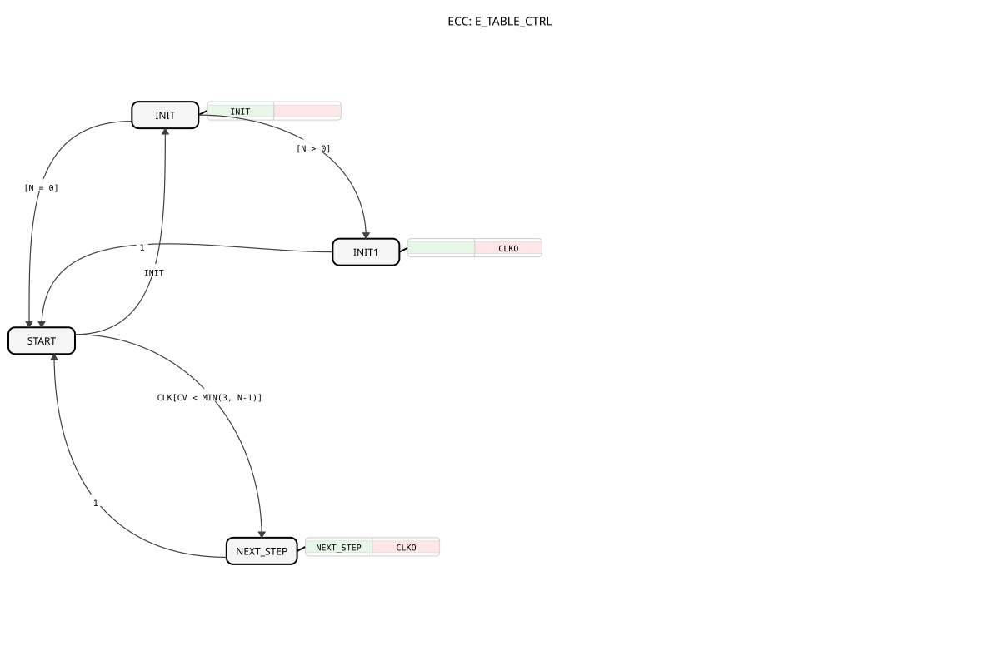

# E_TABLE_CTRL

* * * * * * * * * *

## Introduction
The **E_TABLE_CTRL** is a support function block for E_TABLE according to IEC 61499-1 (Annex A), under the EPL-2.0 license. Version 1.0 enables precise control of event sequences based on a configurable time table.

## Interface Structure

### **Event Inputs**

- `INIT`: Initializes the event table (with DT and N parameters)

- `CLK`: Clock signal for table increment

### **Event Outputs**

- `CLKO`: Generated clock event (with DTO and CV data)

### **Data Inputs**

- `DT` (TIME array): Time intervals for event generation

- `N` (UINT): Number of active time steps

### **Data Outputs**

- `DTO` (TIME): Current time interval
- `CV` (UINT): Current event index (0..N-1)

## Functionality

1. **Initialization**:

- On the `INIT` event, the index (CV) is set to 0

- The first time interval (DTO) is taken from the DT array

2. **Table Control**:

- Each `CLK` event increments CV by 1

- The next time interval from the DT array is loaded

- `CLKO` is generated at each step

3. **State Machine** (ECC):

- **START**: Wait state

- **INIT**: Initialization phase

- **INIT1**: First event generation

- **NEXT_STEP**: Table progress

## Technical Features

✔ **Table-driven** Scheduling
✔ **Array-based** configuration (up to 4 time steps)
✔ **State-based** implementation (BasicFB)
✔ **Real-time capable** event generation

## Application Scenarios

- **Process control**: Complex timing sequences
- **Test automation**: Programmable test sequences
- **Machine control**: Motion sequences
- **Production lines**: Cycle-controlled processes

## Relationship to E_TABLE

The `E_TABLE_CTRL` block is not intended as a standalone block for direct use, but rather as the **internal control logic** of the composite function block `E_TABLE`.

Within `E_TABLE`, `E_TABLE_CTRL` interacts with a `E_DELAY` block:

1. `E_TABLE_CTRL` receives the `START` command and calculates the first delay time, `DTO`.

2. It sends `DTO` via `CLKO` to the `E_DELAY` block.

1. `DTO` to `CLKO`.

2.

3. `E_DELAY` 3. After `E_DELAY` has expired, it signals this via its `EO` output back to the `CLK` input of `E_TABLE_CTRL`.

4. `E_TABLE_CTRL` then calculates the next delay time, and the cycle repeats.

This block thus encapsulates the pure state logic (which step is next, how long it takes), while `E_DELAY` executes the actual time delay.

4. `E_TABLE_CTRL` then calculates the next delay time, and the cycle repeats.

This block therefore encapsulates the pure state logic (which step is next, how long it takes), while `E_DELAY` performs the actual time delay. ## 🛠️ Related Exercises

* [Exercise_175](../../../Uebungen/test_B/Uebungen_doc/Uebung_175.md)

## Conclusion

The E_TABLE_CTRL function block extends the possibilities of table-driven event generation:

- Flexible configuration of multiple time intervals
- Precise control of complex processes
- Robust state machine implementation

Thanks to its array-based timing, it is ideally suited for applications with variable process steps. Integration as a BasicFB ensures reliable operation in IEC 61499-based control systems.