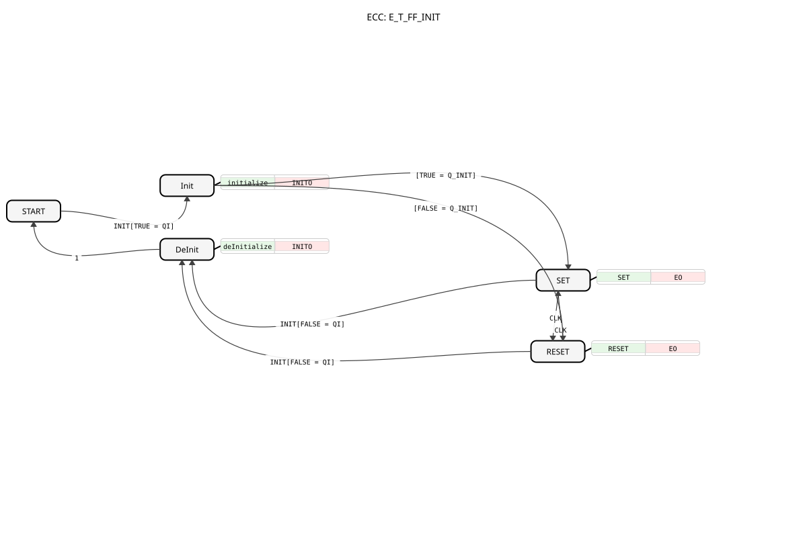

# E_T_FF_INIT

* * * * * * * * * *

## Introduction

`E_T_FF_INIT` (toggle flip-flop with initialization) combines the toggling behaviour of a toggle flip-flop (output `Q` switches state on every `CLK` event) with an explicit `INIT`/`INITO` interface for setting a defined start value.

## Interface Structure

### **Event Inputs**

- **INIT**: Initialization request, carries `QI` and `Q_INIT`.
- **CLK**: Clock event, triggers a state change of `Q`.

### **Event Outputs**

- **INITO**: Confirms (de-)initialization, carries `QO`.
- **EO**: Triggered on every `CLK` event, carries `Q`.

### **Data Inputs**

- **QI** (BOOL): Input event qualifier — `TRUE` initializes, `FALSE` deinitializes.
- **Q_INIT** (BOOL): The value `Q` is set to during initialization.

### **Data Outputs**

- **QO** (BOOL): Output event qualifier, mirrors `QI`.
- **Q** (BOOL): The current state of the flip-flop.

## Functionality

`INIT` with `QI = TRUE` initializes `Q` via `Q_INIT` (states `Init` → `SET`/`RESET`, depending on `Q_INIT`). During normal operation, every `CLK` event flips the state: from `SET` to `RESET` and back, each confirmed via `EO` carrying the current `Q`. `INIT` with `QI = FALSE` deinitializes the block (`DeInit` → `START`).

## Technical Features

- **Toggle instead of set/reset**: Unlike [E_RS_SYM_INIT](E_RS_SYM_INIT.md)/[E_SR_SYM_INIT](E_SR_SYM_INIT.md), which have separate `S`/`R` inputs, `E_T_FF_INIT` has only a single clock input `CLK` that toggles between `SET` and `RESET` on every event.
- **Same INIT/DeInit structure** as the `_SYM_INIT` blocks: `QI` switches between initialization and deinitialization, `Q_INIT` determines the start value.

## State Overview

| State | Meaning |
| --- | --- |
| START | Unconfigured initial state |
| Init | Initialization in progress, `QO := QI` |
| DeInit | Deinitialization in progress, `QO := FALSE` |
| SET | `Q = TRUE`, switches to `RESET` on `CLK` |
| RESET | `Q = FALSE`, switches to `SET` on `CLK` |

## Application Scenarios

- **Blink logic with a defined start state**: A signal should toggle on every clock tick, but start with a known initial value (`Q_INIT`) after system startup instead of a random state.
- **Frequency division**: `E_T_FF_INIT` halves the event frequency from `CLK` to `EO` (returns to the same state every second `CLK`), with a controlled start value.

## Comparison with similar function blocks

- **`E_T_FF`**: the same basic toggle functionality without an `INIT`/`INITO` interface.
- **[E_RS_SYM_INIT](E_RS_SYM_INIT.md) / [E_SR_SYM_INIT](E_SR_SYM_INIT.md)**: the same INIT/DeInit structure, but with separate set/reset inputs instead of a single clock input.
- **[E_T_FF_SR_SYM](../E_T_FF_SR_SYM.md) / [E_T_FF_SR_SYM_INIT](../E_T_FF_SR_SYM_INIT.md)**: additionally combine `S`/`R` inputs with the toggle behaviour.

## Conclusion

`E_T_FF_INIT` provides a toggle flip-flop with a configurable, reliably defined start value and is suitable for blink and frequency-divider logic where the state after system startup must not be left to chance.
