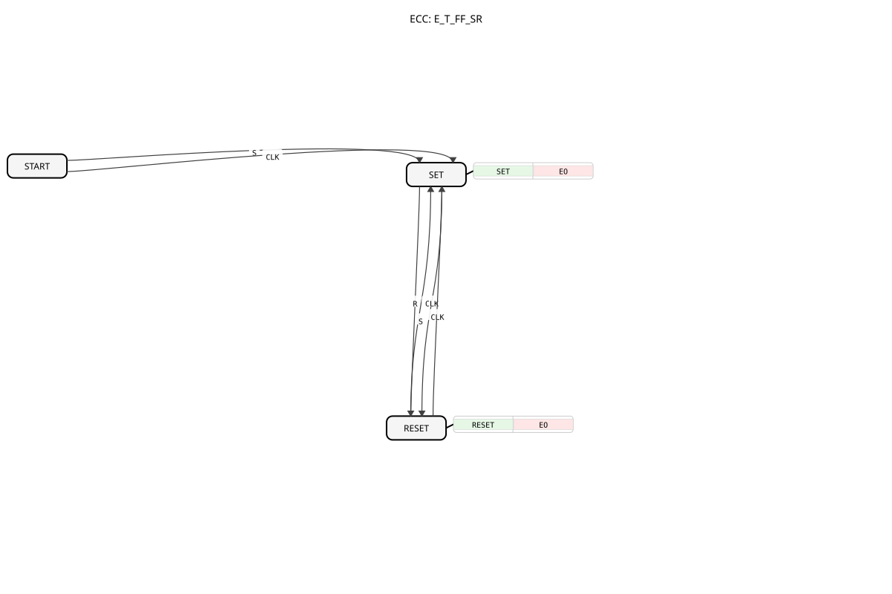

# E_T_FF_SR
## 🎧 Podcast

* [The E_T_FF_SR Block: The Heart of IEC 61499 – Storing, Switching, Responding ](https://podcasters.spotify.com/pod/show/iec-61499-grundkurs-de/episodes/Der-E_T_FF_SR-Baustein-Herzstck-der-IEC-61499--Speichern--Umschalten--Reagieren-e3682dm)
* [Unpacking E_T_FF_SR: The Secret Toggle Switch of Industrial Control Systems ](https://podcasters.spotify.com/pod/show/iec-61499-prime-course-en/episodes/Unpacking-E_T_FF_SR-The-Secret-Toggle-Switch-of-Industrial-Control-Systems-e367ntv)
## Introduction
The `E_T_FF_SR` (Event-driven Toggle Flip-Flop with Set/Reset) is an extended bistable function block according to IEC 61499. It combines the functionality of a `E_T_FF` (Toggling) with additional `S` (Set) and `R` (Reset) inputs.

## Interface Structure

### **Event Inputs:**
- **S (Set)**: Sets the output `Q` to `TRUE`.
- **R (Reset)**: Sets the output `Q` to `FALSE`.
- **CLK (Clock)**: Triggers a toggle of the output `Q`.

### **Event Outputs:**
- **EO (Event Output)**: Triggered when the state of `Q` changes.
- **Associated Data**: `Q`

### **Data Outputs:**
- **Q**: The current state of the flip-flop (data type: `BOOL`).

## Functionality
The `E_T_FF_SR` is a stateful component whose output `Q` is influenced by three event inputs:

1. **Set (S)**: When a `S` event occurs, `Q` is set to `TRUE`. If `Q` was previously `FALSE`, `EO` is triggered.

2. **Reset (R)**: When a `R` event occurs, `Q` is set to `FALSE`. If `Q` was previously `TRUE`, `EO` is triggered.

3. **Toggling (CLK)**: When a `CLK` event occurs, `Q` is toggled. If `Q` changes its state, `EO` is triggered.

### Special Features of Behavior from the `START` State

The function block starts in the `START` state (implies `Q` is undefined/`FALSE`).

- If the first event is `S`, `Q` is set to `TRUE`.

### - If the first event is `R`, `Q` is set to `FALSE`.
- **If the first event is `CLK`, `Q` is set to `TRUE`** (not toggled from `FALSE` to `TRUE`). Subsequent `CLK` events will then toggle normally.

## Technical Features
- **Asynchronous Set/Reset**: The `S` and `R` inputs can overwrite the state of `Q` at any time.
- **Toggle Function**: The `CLK` input allows for easy state switching.
- **No Prioritization (Dominance)**: As with `E_RS` and `E_SR`, there is no fixed priority when `S`, `R`, or `CLK` arrive simultaneously. The processing order of the 4diac runtime environment determines the final state.
- **Initial Behavior with `CLK`**: Upon receiving a `CLK` event from the `START` state, the function block is initially set (`Q=TRUE`) instead of toggling. This should be considered during system initialization.

## Application Scenarios
- **Control with Manual Override**: A toggle switch (`CLK`) for a lamp, which can be switched directly on (`S`) or off (`R`) if needed (e.g., for safety reasons).
- **Mode Switching**: Switch between different modes (`CLK`), with the option to directly access a basic mode (`R`) or a special mode (`S`).
- **Error Reset and Toggle**: An error state can be set using `S`, acknowledged using `R`, and the error handling state can be toggled using `CLK`.

## 🛠️ Related Exercises
* [Exercise_004a7](../../../Uebungen/test_B/Uebungen_doc/Uebung_004a7.md)
* [Exercise_006a](../../../Uebungen/test_B/Uebungen_doc/Uebung_006a.md)
* [Exercise_006a2](../../../Uebungen/test_B/Uebungen_doc/Uebung_006a2.md)
* [Exercise_006a3](../../../Uebungen/test_B/Uebungen_doc/Uebung_006a3.md)
* [Exercise_006a4](../../../Uebungen/test_B/Uebungen_doc/Uebung_006a4.md)
* [Exercise_179](../../../Uebungen/test_B/Uebungen_doc/Uebung_179.md)
* [Exercise_180](../../../Uebungen/test_B/Uebungen_doc/Uebung_180.md)

## Conclusion
The `E_T_FF_SR` block offers maximum flexibility for memory and control tasks by combining the toggle function with direct set and reset capabilities. combined. The specific behaviors of the `START` state and the lack of a prioritization guarantee for simultaneous events must be carefully considered during implementation.

---

### 🌐 Related topic subpages on ms-muc-docs.de
* [🌐 Eclipse 4diac IDE & color reference on ms-muc-docs.de](https://www.ms-muc-docs.de/iec-61499/eclipse-4diac/)
