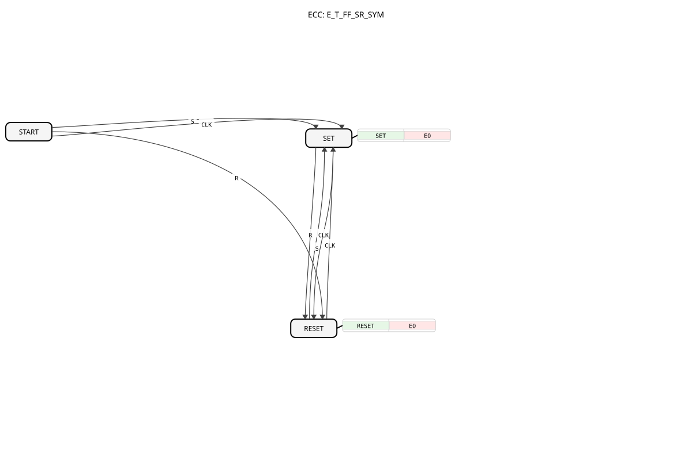

# E_T_FF_SR_SYM

* * * * * * * * * *
## Introduction

`E_T_FF_SR_SYM` combines the functionality of [E_RS_SYM](E_RS_SYM.md) (bistable set/reset with symmetric start-up) and a toggle flip-flop in a single block: in addition to the `S` and `R` inputs, it has a clock input `CLK` that toggles output `Q` independently of `S`/`R`.

## Interface Structure

### **Event Inputs**

- **S (Set)**: Sets `Q` to `TRUE`.
- **R (Reset)**: Sets `Q` to `FALSE`.
- **CLK**: Inverts the current state of `Q` (toggle).

### **Event Outputs**

- **EO**: Triggered after every `S`, `R`, or `CLK` event, carries `Q`.

### **Data Outputs**

- **Q** (BOOL): The current state.

## Functionality

From the initial state `START`, `S`, `R`, **and** `CLK` all lead to a defined follow-up state (`CLK` leads to `SET`) — the symmetric start-up behaviour of `E_RS_SYM` applies here to all three events. During normal operation (states `SET`/`RESET`), `S` switches to `SET`, `R` to `RESET`, and `CLK` switches to the *opposite* state each time (toggle) — independent of the preceding `S`/`R` call. Every transition sets `Q` accordingly and triggers `EO`.

## Technical Features

- **Combined set/reset/toggle behaviour**: Unlike `E_T_FF`, which only toggles, `Q` can here be set deliberately via `S`/`R` as well as toggled via `CLK`.
- **Symmetric start-up for all three inputs**: `START` reacts to `S`, `R`, and `CLK` equally well-defined.
- **No init mechanism**: For a configurable start value, see [E_T_FF_SR_SYM_INIT](E_T_FF_SR_SYM_INIT.md).

## State Overview

| State | Meaning |
|---|---|
| START | Initial state, reacts symmetrically to `S`, `R`, `CLK` |
| SET | `Q = TRUE`; `R`→RESET, `CLK`→RESET |
| RESET | `Q = FALSE`; `S`→SET, `CLK`→SET |

## Application Scenarios

- **Manual operation with clock override**: A state can be either deliberately set/reset (`S`/`R`, e.g. by an operator) or toggled by a clock (`CLK`, e.g. by a timer), without needing two separate blocks.
- **Blink logic with override**: A blink signal (`CLK`) can be overridden at any time by an explicit `S`/`R`.

## Comparison with similar function blocks

- **[E_RS_SYM](E_RS_SYM.md)**: the same set/reset logic, but without the `CLK` toggle input.
- **`E_T_FF`**: pure toggle block without `S`/`R`.
- **[E_T_FF_SR_SYM_INIT](E_T_FF_SR_SYM_INIT.md)**: the same functionality, extended with `INIT`/`INITO`.

## Conclusion

`E_T_FF_SR_SYM` combines deliberate set/reset with toggle functionality in a single block with guaranteed, well-defined start-up behaviour, making it suitable wherever both modes of operation are needed at once.
