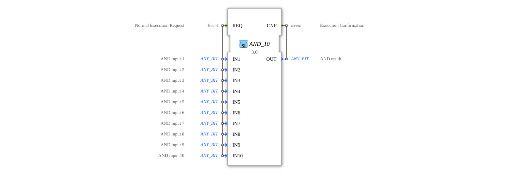

# AND_10

* * * * * * * * * *
## Introduction

The `AND_10` function block is a generic building block for calculating a bitwise logical AND operation. It supports up to 10 input variables and is classified according to the IEC 61131-3 standard. This function block is part of the `iec61131::bitwiseOperators` package and is suitable for applications requiring logical operations at the bit level.

## Interface Structure

### **Event Inputs**

- **REQ**: Starts the execution of the function block. It is linked to all inputs (`IN1` to `IN10`).

### **Event Outputs**

- **CNF**: Signals the completion of the calculation. Linked to output `OUT`.

### **Data Inputs**

- **IN1** to **IN10** (`ANY_BIT`): Up to 10 input variables for bitwise AND operation. Each input can be any bit data type (e.g., BOOL, BYTE, WORD, DWORD).

### **Data Outputs**

- **OUT** (`ANY_BIT`): Result of the bitwise AND operation of all inputs. The data type corresponds to that of the inputs.

### **Adapters**

- No adapters available.

## Functionality

The `AND_10` function block performs a bitwise logical AND operation on the values of all active inputs (`IN1` to `IN10`). The result is output at `OUT` as soon as the `REQ` event is received. The calculation is confirmed by the `CNF` event.

## Technical Features

- **Generic Implementation**: The function block uses the generic class `GEN_AND`, which allows for flexible use with various bit data types.
- **Scalability**: Supports up to 10 inputs, enabling more complex logical operations.

## State Overview

1. **Idle State**: Waits for the `REQ` event.
2. **Calculation State**: Executes the AND operation as soon as `REQ` is activated.
3. **Output State**: Outputs the result via `OUT` and signals completion with `CNF`.

## Application Scenarios

- Logical filtering of signal groups.
- Bitwise masking of data values.
- Control logic in industrial automation systems.

## ⚖️ Comparison with Similar Function Blocks

- **Standard AND Function Block**: Typically supports only 2 inputs. `AND_10` offers greater flexibility with 10 inputs.
- **Generic Logic Blocks**: Similarly generic blocks could support fewer inputs or more specific data types.

## Conclusion

The `AND_10` function block is a versatile tool for bitwise logic operations in IEC 61131-3-based control systems. Its generic nature and support for up to 10 inputs make it particularly useful for complex logic tasks.
