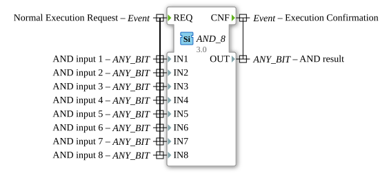

# AND_8

* * * * * * * * * *
## Introduction

The function block `AND_8` performs a bitwise logical AND operation on up to eight inputs. It is a generic function block that can work with various bit data types. The block is classified according to the IEC 61131-3 standard and is used for processing Boolean operations.

## Interface Structure

### **Event Inputs**

- **REQ**: Starts the execution of the function block. The operation is executed when this event occurs. It is linked to all data inputs (`IN1` to `IN8`).

### **Event Outputs**

- **CNF**: Confirms the execution of the function block. This event is output after the calculation and is linked to the data output `OUT`.

### **Data Inputs**

- **IN1** to **IN8** (`ANY_BIT`): Eight inputs for bitwise AND operations. Each input can accept any bit data type (e.g., BOOL, BYTE, WORD, DWORD, LWORD).

### **Data Outputs**

- **OUT** (`ANY_BIT`): The result of the bitwise AND operation on all inputs. The data type corresponds to that of the inputs.

### **Adapters**

The function block does not have any adapters.

## **Adapters** ## Functionality

The `AND_8` block performs a bitwise AND operation on the values of all active inputs (`IN1` to `IN8`). The result is output at `OUT`. The operation is initiated by the event `REQ` and acknowledged by `CNF`.

## Technical Features

- **Generic Implementation**: The block can work with different bit data types because the inputs and outputs are of type `ANY_BIT`.
- **Flexible Number of Inputs**: Up to eight inputs can be used, and not all of them need to be configured.

## State Overview

1. **Idle State**: The block waits for the event `REQ`.
2. **Execution State**: At `REQ`, the inputs are processed and the result is calculated.
3. **Acknowledgement State**: After the calculation, `CNF` is triggered and the result is output to `OUT`.

## Application Scenarios

- Logical combination of multiple bit signals in control applications.
- Filtering of signals by bitwise masking.
- Generic processing of bit data in complex automation systems.

## ⚖️ Comparison with Similar Blocks

- **AND (Standard)**: Standard AND block with typically two inputs. `AND_8` offers greater flexibility through eight inputs and generic types.
- **GEN_AND**: Generic AND implementation that serves as the basis for `AND_8`. `AND_8` is a specialized version with a fixed number of inputs.

## Conclusion

The `AND_8` function block is a powerful tool for bitwise logic operations in IEC 61131-3 compliant control systems. Its generic nature and flexible number of inputs make it particularly versatile.
