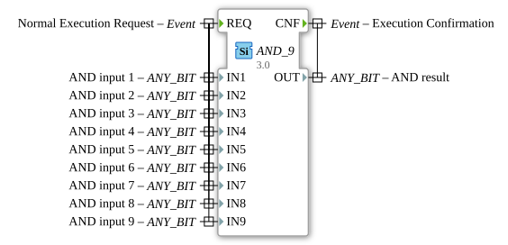

# AND_9

* * * * * * * * * *
## Introduction
The function block `AND_9` performs a bitwise logical AND operation on up to nine input variables. It is a generic function block that can work with various bit data types. The block is classified according to the IEC 61131-3 standard and is suitable for automation applications.

## Interface Structure

### **Event Inputs**
- `REQ` (Normal Execution Request): Starts the execution of the function block. The operation is executed when this event occurs.

### **Event Outputs**
- `CNF` (Execution Confirmation): Signals successful completion of the operation.

### **Data Inputs**
- `IN1` to `IN9` (ANY_BIT): Up to nine input variables on which the bitwise AND operation is performed. Each input can have any bit data type (e.g., BOOL, BYTE, WORD, DWORD, LWORD).

### **Data Outputs**
- `OUT` (ANY_BIT): The result of the bitwise AND operation on all input variables. The data type corresponds to that of the input variables.

### **Adapters**
No adapters are available.

#
## ## Functionality
The function block `AND_9` performs a bitwise AND operation on the values of the input variables `IN1` through `IN9`. The result is output to `OUT`. The operation is initiated by the event `REQ` and confirmed upon completion by the event `CNF`.

## Technical Features
- **Generic Implementation**: The function block can work with various bit data types, enabling high flexibility.
- **Scalability**: Supports up to nine input variables, allowing for more complex logical operations.

## State Overview

1. **Idle State**: Waits for the event `REQ`.

2. **Execution State**: Performs the bitwise AND operation.

3. **Acknowledge State**: Sends the event `CNF` and outputs the result to `OUT`.

## Application Scenarios
- Logical combination of multiple digital signals in automation technology.
- Filtering of signals using logical masks.
- Implementation of safety functions where multiple conditions must be met simultaneously.

## ⚖️ Comparison with Similar Function Blocks
- **AND (Standard)**: By default, many PLC systems only support two-input AND operations. `AND_9` extends this functionality to up to nine inputs.
- **GEN_AND**: The generic AND block on which `AND_9` is based can be configured for various data types and a variable number of inputs.

## Conclusion
The `AND_9` function block is a powerful tool for bitwise logic operations in automation technology. Its generic nature and support for up to nine inputs make it particularly flexible and versatile. Ideal for applications requiring complex logical operations.
