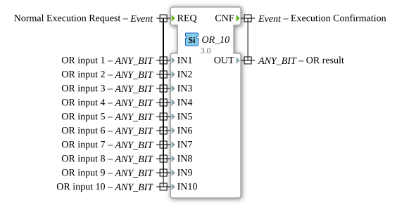

# OR_10

* * * * * * * * * *
## Introduction

The function block `OR_10` performs a bitwise OR operation on up to 10 input variables. It is a generic function block that can work with any bit data type (ANY_BIT). The block is classified according to the IEC 61131-3 standard and is used for the simple execution of logical OR operations in control applications.

## Interface Structure

### **Event Inputs**

- **REQ**: Starts the execution of the function block. When this event is triggered, all input variables (IN1 to IN10) are read and the OR operation is performed.

### **Event Outputs**

- **CNF**: Signals the successful completion of the OR operation. This event is output along with the result (OUT).

### **Data Inputs**

- **IN1 to IN10**: Up to 10 input variables of type ANY_BIT, containing the values to be combined. Each variable can have any bit data type (e.g., BOOL, BYTE, WORD, DWORD, etc.).

### **Data Outputs**

- **OUT**: The result of the bitwise OR operation on all input variables. The data type corresponds to that of the input variables.

### **Adapters**

No adapters are defined for this function block.

## Functionality

The function block performs a bitwise OR operation on all active input variables. This means that a logical OR operation is performed on each bit of the input variables. The result is output at the output variable OUT. The operation is initiated by the REQ event and confirmed by the CNF event.

## Technical Features

- **Generic Implementation**: The function block can work with any bit data type, enabling high flexibility.
- **Scalability**: Up to 10 input variables can be processed, making the block suitable for more complex applications.

## State Overview

1. **Idle State**: The block waits for the REQ event.
2. **Execution State**: Upon receiving REQ, the input variables are read and the OR operation is performed.
3. **Acknowledge State**: After successful operation, the CNF event is triggered, and the block returns to the idle state.

## Application Scenarios

- Logical operations in control applications
- Signal processing in industrial automation systems
- Combining multiple binary signals to produce a result

## ⚖️ Comparison with similar function blocks

Compared to simple OR blocks with fewer inputs, OR_10 offers the ability to combine up to 10 signals, making it suitable for more complex applications. Other blocks are often limited to fewer inputs or are not implemented generically.

## Conclusion

The OR_10 function block is a flexible and powerful tool for bitwise OR operations in IEC 61131-3-based control systems. Its generic nature and support for up to 10 input variables make it particularly suitable for demanding applications.