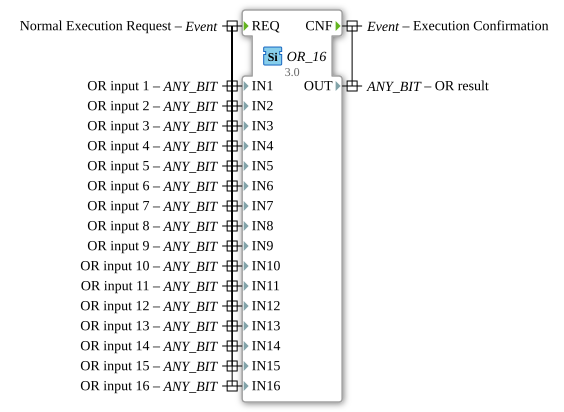

# OR_16

* * * * * * * * * *
## Introduction

The function block `OR_16` performs a bitwise logical OR operation on up to 16 input variables. It is a generic function block that can work with various bit data types (ANY_BIT). The block is part of the package `iec61131::bitwiseOperators` and conforms to the IEC 61131-3 standard.

## Interface Structure

### **Event Inputs**

- `REQ` (Normal Execution Request): Triggers the calculation. It is processed with all 16 input variables.

### **Event Outputs**

- `CNF` (Execution Confirmation): Confirms the execution of the operation. Linked to the result `OUT`.

### **Data Inputs**

16 inputs of type `ANY_BIT`:

- `IN1` to `IN16`: The input values for the OR operation. Each input is annotated as "OR input X" (where X is the input number).

### **Data Outputs**

- `OUT` (ANY_BIT): The result of the bitwise OR operation of all input values.

### **Adapters**

The function block does not use adapters.

## Functionality

Upon receiving the `REQ` event, the block performs a bitwise OR operation on all active input values (`IN1` to `IN16`). The result is output to `OUT`, and the `CNF` event is triggered.

## Technical Features

- Generic Implementation: Works with all `ANY_BIT` data types (e.g., BOOL, BYTE, WORD, DWORD, LWORD)
- Supports up to 16 input variables
- Compatible with IEC 61131-3 standard

## State Overview

1. Wait State: Waits for `REQ` event
2. Execute State: On `REQ`, inputs are processed and the result is calculated
3. Acknowledge State: Outputs the result and triggers `CNF`

## Application Scenarios

- Bitwise logic operations in control applications
- Signal processing with multiple conditions
- Generic logic blocks in libraries

## ⚖️ Comparison with Similar Blocks

- Compared to simpler OR blocks (e.g., OR_2), it offers OR_16 offers significantly more inputs
- Similar to AND_16 or XOR_16, but with a different logical operation
- Generic implementation allows for more flexible use than type-specific blocks

## Conclusion

The OR_16 function block offers a flexible and standards-compliant solution for bitwise OR operations with up to 16 inputs. Its generic nature makes it versatile, while its clear interface structure facilitates integration into various control applications.
