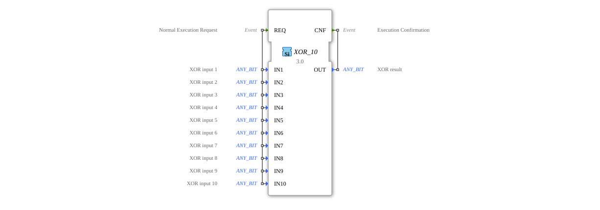

# XOR_10

* * * * * * * * * *
The XOR_10 function block is a generic function block for calculating a bitwise XOR operation with up to 10 inputs. It is part of the IEC 61131-3 standard library for bitwise Boolean operations and can be used with various bit data types (ANY_BIT).

- **REQ**: Starts the calculation of the XOR operation. It connects to all data inputs (IN1 to IN10).
- **CNF**: Signals the completion of the calculation and outputs the result via the OUT output.
- **IN1** to **IN10** (ANY_BIT): Up to 10 input values for XOR calculation. Each input can contain any bit data type (BOOL, BYTE, WORD, DWORD, LWORD).
- **OUT** (ANY_BIT): Result of the bitwise XOR operation of all active inputs.

### Data Outputs

### Data Inputs

### Event Outputs

### Event Inputs

## Interface Structure

## Introduction

### **Adapters**

This function block does not use adapters.

Upon receiving the REQ event, the function block calculates a bitwise XOR operation of all active inputs (IN1 to IN10). The result is output at the OUT output, and the CNF event is triggered.

- Result bit = 1 if an odd number of input bits at that position are 1
- Result bit = 0 if an even number of input bits at that position are 1
- Supports generic bit data types (ANY_BIT)
- Processes up to 10 input values
- All inputs must have the same data type
- Unused inputs are treated as 0
- Part of the `iec61131::bitwiseOperators` package
1. **Wait State**: Waits for REQ event
2. **Compute State**: Performs XOR operation
3. **Output State**: Sends result and CNF event
4. Returns to Wait State
- Bitwise encryption operations
- Parity checks
- Error detection in digital systems
- Control logic with multiple Input Signals
- Generic Logic Operations in Automation Systems
- Compared to simple 2-input XOR blocks, XOR_10 offers greater flexibility
- Similar to OR_10/AND_10 blocks, but with XOR logic
- Generic implementation as opposed to type-specific blocks (e.g., XOR_BOOL, XOR_WORD)

The XOR_10 function block provides a flexible solution for complex bitwise XOR operations in IEC 61131-3-based control systems. Its generic nature and support for up to 10 inputs make it particularly suitable for applications requiring more than the traditional two inputs.
## Functionality

## Technical Features

## State Overview

## Application Scenarios

## ⚖️ Vergleich mit ähnlichen Bausteinen

## Conclusion