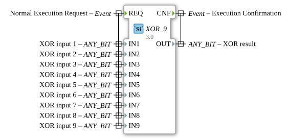

# XOR_9

* * * * * * * * * *
## Introduction

The function block `XOR_9` is used for bitwise calculation of the XOR operation with up to nine inputs. It is part of the standard bit operations according to IEC 61131-3 and enables the processing of any bit data type (`ANY_BIT`).

## Interface Structure

### **Event Inputs**

- `REQ` (Normal Execution Request): Starts the calculation of the XOR operation. Triggers the evaluation of all combined data inputs.

### **Event Outputs**

- `CNF` (Execution Confirmation): Signals the completion of the calculation and outputs the result via the data output `OUT`.

### **Data Inputs**

- `IN1` to `IN9` (XOR input 1-9): Up to nine inputs for bitwise XOR operation. Each input supports the data type `ANY_BIT` (e.g., BOOL, BYTE, WORD, DWORD, LWORD).

### **Data Outputs**

- `OUT` (XOR result): Result of the bitwise XOR operation of all active inputs. The data type corresponds to that of the inputs (`ANY_BIT`).

### **Adapters**

This function block has no adapters.

## Functionality

When the `REQ` event is triggered, the function block calculates the XOR operation of all passed input values (`IN1` to `IN9`). The result is output to `OUT`, and the `CNF` event signals that the result is ready.

**Example (for BOOL inputs):**
OUT = IN1 XOR IN2 XOR ... XOR IN9`

## Technical Features

- **Generic Implementation:** Supports all `ANY_BIT` data types by using the generic class `GEN_XOR`.
- **Flexible Number of Inputs:** Unused inputs are ignored (act as neutral elements).
- **Bitwise Operation:** The operation is performed separately for each bit (for multi-bit data types).

## State Overview

1. **Idle:** Waits for the `REQ` event.
2. **Processing:** Performs an XOR operation and sets `OUT`.
3. **Ready:** Sends `CNF` and returns to Idle.

## Application Scenarios

- Parity checking in communication protocols
- Toggles control signals (e.g., switching between states)
- Basic cryptographic operations
- Error detection in binary data

## ⚖️ Comparison with similar function blocks

| Feature | XOR_9 | Standard XOR (2 inputs) |
|---------------|-------------|----------------------------|
| Number of inputs | 9 | 2 |
| Data type | ANY_BIT | Type-dependent (e.g., BOOL) |
| Flexibility | High | Low |

## Conclusion

The `XOR_9` function block extends the classic XOR functionality by supporting multiple inputs and generic data types. Ideal for applications that require more complex bitwise operations without having to build individual function block chains. IEC 61131-3 compliance ensures broad compatibility.
