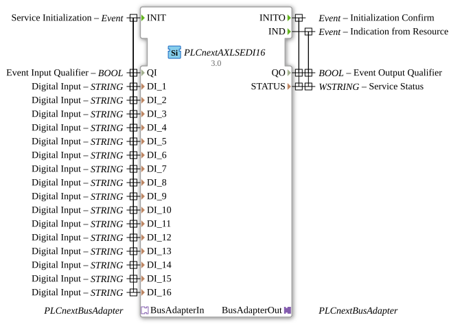

# PLCnextAXLSEDI16

* * * * * * * * * *
## Introduction
The PLCnextAXLSEDI16 is a Service Interface Function Block for connecting to PLCnext systems. This function block serves as an interface for digital inputs and enables communication with the PLCnext bus architecture. It supports 16 digital input channels and offers standardized initialization and status feedback.

## Interface Structure

### **Event Inputs**

- **INIT**: Service Initialization - Initializes the function block with the configured parameters

### **Event Outputs**

- **INITO**: Initialization Confirm - Confirms successful initialization

- **IND**: Indication from Resource - Signals status changes or events from the resource

### **Data Inputs**

- **QI** (BOOL): Event Input Qualifier - Controls the initialization

- **DI_1 to DI_16** (STRING): Digital Input - 16 digital input channels for configuration

### **Data Outputs**

- **QO** (BOOL): Event Output Qualifier - Event output status

- **STATUS** (WSTRING): Service Status - Detailed status information

### **Adapters**

- **BusAdapterOut** (Plug): Outgoing bus adapter for PLCnext Communication

- **BusAdapterIn** (Socket): Incoming bus adapter for PLCnext communication

## Functionality
The function block initializes itself via the INIT event and configures the 16 digital input channels based on the DI_Parameters. After successful initialization, it confirms this via INITO. During operation, it continuously monitors the inputs and signals changes via the IND event. Communication with the PLCnext bus takes place via the integrated adapter interfaces.

## Technical Features
- Supports 16 independent digital input channels
- String-based input configuration
- Unicode-enabled status feedback (WSTRING)
- Integrated PLCnext bus adapter communication
- Standard-compliant IEC 61499-2 implementation

## State Overview
1. **Not Initialized**: Function block awaits INIT event
2. **Initialization**: Processing configuration parameters
3. **Ready for Operation**: Digital input monitoring active
4. **Fault State**: Status feedback issues

## Application Scenarios
- Connecting digital sensors to PLCnext systems
- Industrial automation controllers
- Monitoring systems with multiple input signals
- PLCnext-based control architectures

## ⚖️ Comparison with Similar Blocks
Compared to simple digital input blocks, PLCnextAXLSEDI16 offers enhanced configurability through string parameters and integrated bus communication for PLCnext systems. The 16 channels enable a higher input density than standard modules.

## Conclusion
The PLCnextAXLSEDI16 is a powerful function block for integrating digital inputs into PLCnext-based automation systems. Its flexible configuration and robust bus communication make it ideal for industrial applications with multiple digital signals.