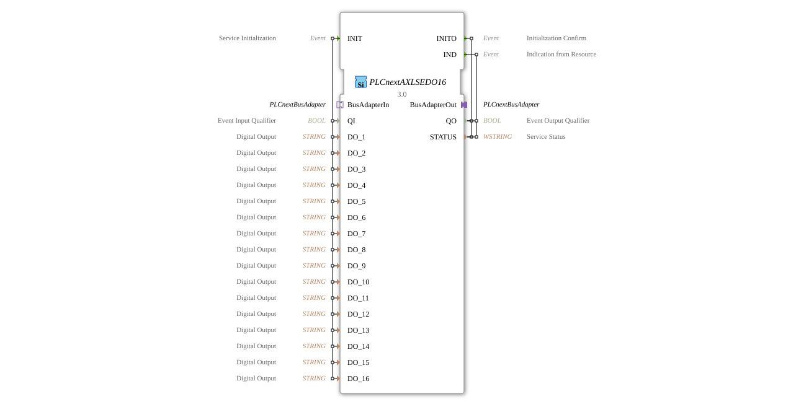

# PLCnextAXLSEDO16

* * * * * * * * * *
## Introduction
The PLCnextAXLSEDO16 is a Service Interface Function Block for controlling 16 digital outputs in PLCnext systems. This block serves as an interface between the IEC 61499-based control logic and the physical outputs of the PLCnext AXLSEDO16 module.

## Interface Structure

### **Event Inputs**
- **INIT**: Service Initialization - Initializes the function block and configures the digital outputs

### **Event Outputs**
- **INITO**: Initialization Confirm - Confirms successful initialization
- **IND**: Indication from Resource - Signals status changes or errors from the resource adapter

### **Data Inputs**
- **QI** (BOOL): Event Input Qualifier - Controls the initialization
- **DO_1** to **DO_16** (STRING): Digital Outputs - Configure the respective output channels

### **Data Outputs**
- **QO** (BOOL): Event Output Qualifier - Status of the event output
- **STATUS** (WSTRING): Service Status - Detailed status information

### **Adapters**
- **BusAdapterOut** (Plug): Outgoing bus adapter for the Communication with the Hardware
- **BusAdapterIn** (Socket): Incoming bus adapter for feedback from the hardware

## Functionality

Upon receiving the INIT event, the module initializes the 16 digital outputs based on the configuration values in DO_1 to DO_16. Initialization is confirmed by INITO. During operation, status changes and errors can be reported via the IND event. Communication with the physical hardware occurs via the bus adapter interfaces.

## Technical Features
- Supports 16 independent digital outputs
- Uses STRING type for output configuration, enabling flexible parameterization
- Integrates seamlessly into PLCnext systems via specific bus adapters
- Provides comprehensive status feedback via the WSTRING variable

## State Overview

1. **Not Initialized**: Block is waiting for the INIT event

2. **Initialization in Progress**: Processing configuration parameters
3. **Ready for Operation**: Outputs are configured and ready for operation
4. **Fault State**: In case of problems, STATUS is populated with error information

## Application Scenarios
- Control of relays and actuators in automation systems
- Control of lighting systems
- Control of valves and motors
- Signal output in process control systems

## ⚖️ Comparison with Similar Blocks

Compared to simpler digital output blocks, PLCnextAXLSEDO16 offers:

- A higher number of channels (16 instead of the typical 16) 8)
- Specific integration for PLCnext hardware
- Extended status feedback
- Flexible string-based configuration

## Conclusion

The PLCnextAXLSEDO16 is a powerful function block for controlling digital outputs in PLCnext environments. Its 16 channels, flexible configurability, and comprehensive status feedback make it ideal for complex automation tasks where multiple actuators need to be controlled simultaneously.