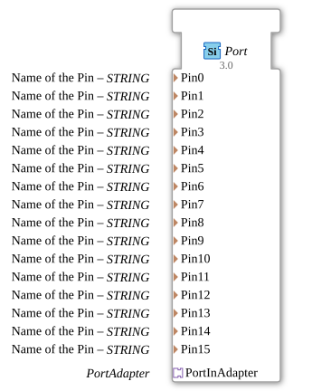

# Port

## 🎧 Podcast

- [The Technology Panorama of 1863: Lanz & Comp. and the Revolution of German Agriculture through Import, Innovation, and Guano](https://podcasters.spotify.com/pod/show/ms-muc-lama/episodes/Das-Technologie-Panorama-von-1863-Lanz--Comp--und-die-Revolution-der-deutschen-Landwirtschaft-durch-Import--Innovation-und-Guano-e39auqa)
- [ESP32-S3-DevKitC-1 Document Analysis: The Memory Monster (32MB Flash/16MB PSRAM) and the Power of Dual USB Ports](https://podcasters.spotify.com/pod/show/ms-muc-lama/episodes/ESP32-S3-DevKitC-1-Doku-Analyse-Das-Speicher-Monster-32MB-Flash16MB-PSRAM-und-die-Macht-der-Dual-USB-Ports-e39hamt)
## Introduction

The Port Function Block serves as a Service Interface Function Block for configuring and managing digital inputs/outputs on an EliteBoard system. It enables the mapping of pin names to physical ports via an adapter mechanism.

## Interface Structure

### **Event Inputs**

*No event inputs available*

### **Event Outputs**

*No event outputs available*

### **Data Inputs**

- **Pin0** (STRING): Name of Pin 0
- **Pin1** (STRING): Name of Pin 1
- **Pin2** (STRING): Name of Pin 2
- **Pin3** (STRING): Name of Pin 3
- **Pin4** (STRING): Name of Pin 4
- **Pin5** (STRING): Name of Pin 5
- **Pin6** (STRING): Name of Pin 6
- **Pin7** (STRING): Name of Pin 7
- **Pin8** (STRING): Name of Pin 8
- **Pin9** (STRING): Name of Pin 9
- **Pin10** (STRING): Name Pin 10
- **Pin 11** (STRING): Name of Pin 11
- **Pin 12** (STRING): Name of Pin 12
- **Pin 13** (STRING): Name of Pin 13
- **Pin 14** (STRING): Name of Pin 14
- **Pin 15** (STRING): Name of Pin 15

### **Data Outputs**

*No data outputs available*

### **Adapters**

- **PortInAdapter** (eclipse4diac::io::eliteboard::PortAdapter): Socket adapter for communication with the port subsystem

## Functionality

The Port FB serves as a configuration interface for up to 16 digital pins. Individual pin names can be assigned via the STRING inputs, which are then passed on to the underlying system via the PortAdapter. The function block itself does not perform any direct input/output operations, but merely provides the configuration parameters.

## Technical Features

- Supports configuration of 16 digital pins
- Uses the STRING data type for pin names
- Implemented as a Service Interface Function Block
- Uses the adapter pattern for hardware abstraction
- Part of the eclipse4diac::io::eliteboard package

## State Overview

Since this is a pure configuration block without event handling, the Port FB has no explicit states. The configuration is set statically via the data inputs.

## Application Scenarios

- Configuration of digital inputs/outputs on EliteBoard systems
- Abstraction of hardware pins using logical names
- Integration into larger control systems with unified pin management
- Reusable pin configurations across various applications

## ⚖️ Comparison with similar components

Compared to direct GPIO components, the Port FB offers a higher level of abstraction by using logical pin names instead of direct hardware addressing. It primarily serves configuration purposes, while other components typically provide the actual input/output functionality.

## Conclusion

The Port Function Block provides an elegant solution for configuration-based pin management in Eclipse 4diac systems. By using adapters, it enables a clear separation between configuration and hardware access, improving the maintainability and portability of control applications.

---

### 🌐 Related topic subpages on ms-muc-docs.de

- [🌐 Eclipse 4diac IDE & Color Reference on ms-muc-docs.de](https://www.ms-muc-docs.de/iec-61499/eclipse-4diac/)
- [🌐 ESP32 & ESP32-S3 DevKit on ms-muc-docs.de](https://www.ms-muc-docs.de/elektrotechnik/mikroelektronik/esp32/esp32-s3-devkit/)

]
