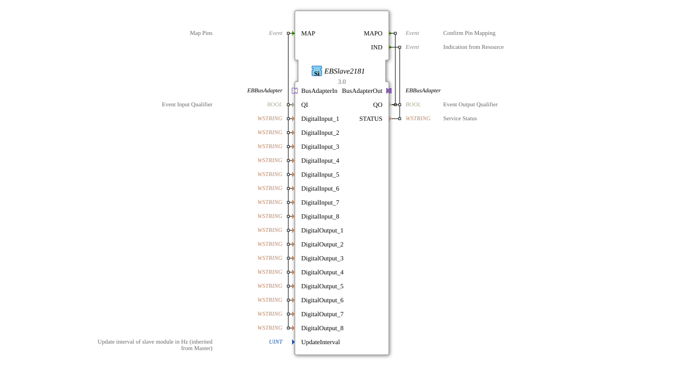

# EBSlave2181

* * * * * * * * * *
## Introduction
The EBSlave2181 is a Service Interface Function Block for communication with EtherBrick slave modules. This function block enables the configuration and monitoring of the digital inputs and outputs of an EtherBrick slave module and serves as an interface between the control logic and the physical fieldbus communication.


## Interface Structure

### **Event Inputs**
- **MAP**: Used to configure pin assignments. Triggers the assignment of digital inputs and outputs.

### **Event Outputs**
- **MAPO**: Confirms successful pin assignment.
- **IND**: Indicates status changes or errors from the slave module.

### **Data Inputs**
- **QI** (BOOL): Event Input Qualifier - Enables/disables the function block
- **DigitalInput_1** to **DigitalInput_8** (WSTRING): Configuration of digital inputs 1-8
- **DigitalOutput_1** to **DigitalOutput_8** (WSTRING): Configuration of digital outputs 1-8
- **UpdateInterval** (UINT): Update interval of the slave module in Hz (inherited from the master)

### **Data Outputs**
- **QO** (BOOL): Event Output Qualifier - Status of the function block
- **STATUS** (WSTRING): Service Status - Contains status information or error messages

### **Adapters**
- **BusAdapterOut** (Plug): Outgoing bus adapter for EtherBrick communication
- **BusAdapterIn** (Socket): Incoming bus adapter for EtherBrick communication

## Functionality
The The EBSlave2181 acts as an intermediary between the IEC 61499 control logic and an EtherBrick slave module. Upon receiving the MAP event, the configured digital inputs and outputs are assigned to the slave module. The MAPO event confirms the successful completion of this assignment. The IND event signals status changes or error states of the slave module.

```
## Technical Features
- Supports 8 digital inputs and 8 digital outputs
- Uses WSTRING data type for pin configuration
- Enables configurable update intervals
- Integrates into the EtherBrick architecture via standardized bus adapters
- Implements qualifier patterns (QI/QO) for reliable status management

## State Overview
The function block has the following operating states:

- **Inactive**: QI = FALSE, function block does not respond to events
- **Configuring**: Processing the MAP event and assigning pins
- **Active**: Successfully configured, waiting for IND events from the slave
- **Error**: STATUS contains error information, QO can be FALSE

## Application Scenarios
- Connecting EtherBrick slave modules in distributed automation systems
- Configuring digital I/O modules in industrial plants
- Integration into control systems with EtherBrick Fieldbus Communication

Real-time Monitoring and Diagnostics of Slave Modules

## ⚖️ Comparison with Similar Components
Compared to generic I/O function blocks, the EBSlave2181 offers specific integration for EtherBrick systems with predefined bus adapter interfaces. It specializes in the configuration and monitoring of slave modules and provides direct support for EtherBrick communication protocols.

## Conclusion
The EBSlave2181 is a specialized service interface function block that provides a reliable and standardized interface for integrating EtherBrick slave modules into IEC 61499-based control systems. Its structured interface and clear state management make it a robust solution for industrial fieldbus communication.
