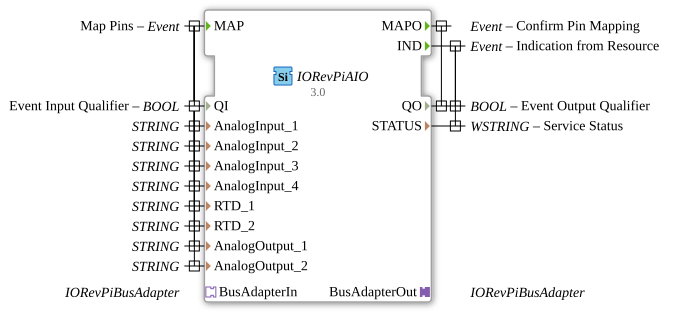

# 🔌 IORevPiAIO

* * * * * * * * * *
## Introduction

The IORevPiAIO function block provides an interface for the analog I/O module of the Revolution Pi from KUNBUS GmbH. This module enables the control and reading of analog inputs and outputs, as well as RTD (Resistance Temperature Detector) sensors, via the Revolution Pi system.

## Interface Structure

### **Event Inputs**

- **MAP**: Starts the pin mapping for all configured analog inputs and outputs

### **Event Outputs**

- **MAPO**: Confirms successful pin mapping
- **IND**: Displays status information from the resource manager

### **Data Inputs**

- **QI** (BOOL): Event Input Qualifier - Enables/Disables the function block
- **AnalogInput_1** (STRING): Configuration for analog input 1
- **AnalogInput_2** (STRING): Configuration for analog input 2
- **AnalogInput_3** (STRING): Configuration for analog input 3
- **AnalogInput_4** (STRING): Configuration for analog input 4
- **RTD_1** (STRING): Configuration for RTD sensor 1
- **RTD_2** (STRING): Configuration for RTD Sensor 2
- **AnalogOutput_1** (STRING): Configuration for Analog Output 1
- **AnalogOutput_2** (STRING): Configuration for Analog Output 2

### **Data Outputs**

- **QO** (BOOL): Event Output Qualifier - Operation Status
- **STATUS** (WSTRING): Detailed Service Status Information

### **Adapters**

- **BusAdapterIn** (Socket): Input adapter for Revolution Pi bus communication
- **BusAdapterOut** (Plug): Output adapter for Revolution Pi bus communication

## Functionality

The IORevPiAIO function block manages communication with the Revolution Pi Analog I/O module. Upon receiving the MAP event, all configured analog inputs and outputs, as well as RTD sensors, are initialized and assigned according to the string parameters. The block uses dedicated bus adapters for communication with the Revolution Pi hardware.

## Technical Features

- Supports up to 4 analog inputs
- Supports up to 2 analog outputs
- Integrated RTD sensor support (2 channels)
- String-based pin mapping configuration
- Bus adapter architecture for low-level communication

## State Overview

The function block has the following operating states:

- **Inactive**: QI = FALSE, no operations
- **Ready**: QI = TRUE, waiting for MAP event
- **Mapping**: Processes pin mapping after MAP event
- **Active**: Successfully configured, ready for data operations

## Application Scenarios

- Industrial process automation with analog sensors
- Temperature measurement with RTD sensors
- Analog signal processing in control systems
- Revolution Pi-based automation solutions

## ⚖️ Comparison with Similar Blocks

Compared to generic analog I/O blocks, IORevPiAIO offers specific integration for Revolution Pi hardware and additionally supports RTD temperature sensors. The bus adapter architecture enables efficient communication with the Revolution Pi system.

## Conclusion

The IORevPiAIO function block offers a reliable and specialized interface for analog I/O operations on Revolution Pi systems. With its integrated support for RTD sensors and flexible configuration via string parameters, it is particularly well-suited for industrial automation applications with analog measurement and control tasks.