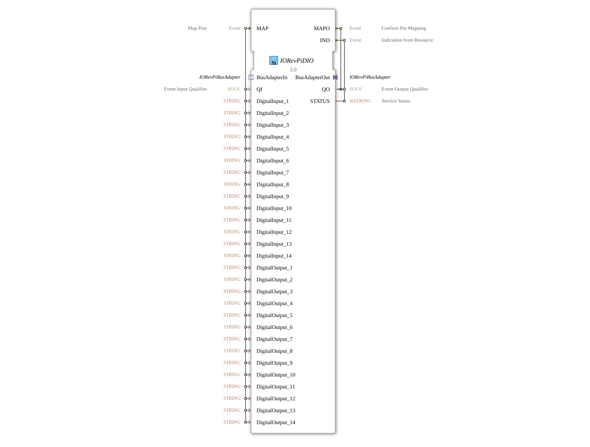

# 🔌 IORevPiDIO

* * * * * * * * * *
## Introduction

The IORevPiDIO function block is a digital input/output module for Revolution Pi systems from KUNBUS GmbH. It enables the control and monitoring of digital inputs and outputs via the Revolution Pi system and serves as an interface between the 4diac IDE and the Revolution Pi hardware.

## Interface Structure

### **Event Inputs**

- **MAP**: Event for mapping the pins with all Digital Input and Digital Output data variables, as well as QI

### **Event Outputs**

- **MAPO**: Confirmation event for successful pin mapping with QO
- **IND**: Indication event from the resource with QO and STATUS

### **Data Inputs**

- **QI** (BOOL): Event Input Qualifier
- **DigitalInput_1** to **DigitalInput_14** (STRING): Configuration of digital inputs 1-14
- **DigitalOutput_1** to **DigitalOutput_14** (STRING): Configuration of digital outputs 1-14

### **Data Outputs**

- **QO** (BOOL): Event Output Qualifier
- **STATUS** (WSTRING): Service Status

### **Adapter**

- **BusAdapterOut** (Plug): Outgoing bus adapter of type IORevPiBusAdapter
- **BusAdapterIn** (Socket): Incoming bus adapter of type IORevPiBusAdapter

## Functionality

This function block enables the configuration and control of up to 14 digital inputs and 14 digital outputs of a Revolution Pi system. The MAP event transmits the pin configurations, which are confirmed with MAPO. The IND output signals status changes and error states. Communication with the hardware occurs via the IORevPiBusAdapter interface.

## Technical Features

- Supports up to 14 digital inputs and 14 digital outputs
- Uses STRING type for pin configuration
- Integrated bus adapter for Revolution Pi communication
- Provides comprehensive status feedback via WSTRING

## State Transitions

1. **Initialization**: Waits for a MAP event with configuration data
2. **Configuration**: Processes pin assignments and confirms via MAPO
3. **Operation**: Monitors digital inputs/outputs and signals via IND
4. **Fault Handling**: Provides status messages in case of communication problems with the hardware

## Application Scenarios

- Industrial automation with Revolution Pi
- Digital signal processing in control systems
- Connecting sensors and actuators to 4diac-based controllers
- Prototyping and development of IoT solutions

## ⚖️ Comparison with Similar Devices

Compared to other I/O devices, IORevPiDIO offers specific support for Revolution Pi hardware with a large number of configurable Inputs/Outputs. The integrated bus adapter enables direct communication with the Revolution Pi platform.

## Conclusion

The IORevPiDIO function block provides a powerful interface for digital inputs/outputs in Revolution Pi systems and allows for easy integration into 4diac-based automation solutions. Its extensive configuration options and reliable status feedback make it a robust solution for industrial applications.

---

### 🌐 Related topic subpages on ms-muc-docs.de

- [🌐 Eclipse 4diac IDE & Color Reference on ms-muc-docs.de](https://www.ms-muc-docs.de/iec-61499/eclipse-4diac/)

]
