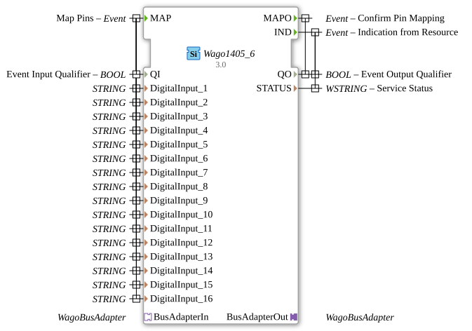

# Wago1405_6

* * * * * * * * * *
## Introduction

The Wago1405_6 is a Service Interface Function Block for connecting to Wago bus systems. This function block serves as an interface for configuring and controlling the digital inputs of a Wago I/O system and enables communication via special bus adapters.

## Interface Structure

### **Event Inputs**

- **MAP**: Map Pins - Used to configure pin assignments for digital inputs

### **Event Outputs**

- **MAPO**: Confirm Pin Mapping - Confirms successful pin mapping
- **IND**: Indication from Resource - Message from the resource interface

### **Data Inputs**

- **QI**: Event Input Qualifier (BOOL) - Qualifies the event inputs
- **DigitalInput_1** to **DigitalInput_16**: Pin Configuration (STRING) - Assigns digital inputs 1-16

### **Data Outputs**

- **QO**: Event Output Qualifier (BOOL) - Qualifies the event outputs
- **STATUS**: Service Status (WSTRING) - Status information of the service interface

### **Adapters**

- **BusAdapterOut**: Outgoing bus adapter (plug) of type eclipse4diac::io::wago::WagoBusAdapter
- **BusAdapterIn**: Incoming bus adapter (socket) of type eclipse4diac::io::wago::WagoBusAdapter

## Functionality

The Wago1405_6 function block allows the configuration of 16 digital inputs via the MAP event. When the MAP event is activated, the pin assignments are configured using the DigitalInput_x parameters. Successful configuration is confirmed via the MAPO event. The IND event is used for asynchronous communication with the underlying resource interface and provides status information.

## Technical Features

- Supports 16 digital inputs
- Uses STRING type for pin configuration
- Implements bidirectional bus adapter communication
- Provides comprehensive status feedback via WSTRING

## State Overview

The function block operates with the following main states:

1. **Inactive**: Waiting for MAP event
2. **Configuration**: Processing pin assignments
3. **Acknowledge**: Sending MAPO acknowledgement
4. **Operation**: Asynchronous status messages via IND

## Application Scenarios

- Connecting Wago 750-1405/750-1406 I/O systems
- Configuring digital inputs in automation systems
- Integration into distributed control systems with 4diac
- Industrial I/O configuration and monitoring

## ⚖️ Comparison with Similar Blocks

Compared to generic I/O function blocks, the Wago1405_6 offers specific Adaptations for Wago bus systems and more extensive configuration options for digital inputs. The integration of the bus adapters enables seamless integration into Wago-specific communication architectures.

## Conclusion

The Wago1405_6 function block represents a specialized solution for connecting and configuring Wago I/O systems. With its extensive configuration options for 16 digital inputs and the integrated bus adapter interface, it offers an efficient solution for industrial automation applications using Wago components.

---

### 🌐 Related topic subpages on ms-muc-docs.de

* [🌐 Eclipse 4diac IDE & color reference on ms-muc-docs.de](https://www.ms-muc-docs.de/iec-61499/eclipse-4diac/)
