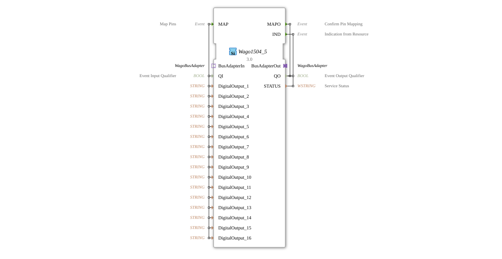

# Wago1504_5

* * * * * * * * * *
## Introduction

The Wago1504_5 is a Service Interface Function Block for controlling the digital outputs of a Wago 750-1504/005-000 module. This function block enables the configuration and control of 16 digital outputs via a bus adapter interface.

## Interface Structure

### **Event Inputs**

- **MAP**: Map Pins - Initializes the pin mapping of the digital outputs

### **Event Outputs**

- **MAPO**: Confirm Pin Mapping - Confirms successful pin mapping
- **IND**: Indication from Resource - Message from the resource adapter

### **Data Inputs**

- **QI**: Event Input Qualifier (BOOL) - Qualifies the event inputs
- **DigitalOutput_1** to **DigitalOutput_16** (STRING) - Configuration strings for the respective digital outputs

### **Data Outputs**

- **QO**: Event Output Qualifier (BOOL) - Qualifies the event outputs
- **STATUS**: Service Status (WSTRING) - Service status information

### **Adapters**

- **BusAdapterOut** (Plug): Outgoing WagoBusAdapter
- **BusAdapterIn** (Socket): Incoming WagoBusAdapter

## Functionality

The Wago1504_5 function block serves as an interface between the 4diac controller and the Wago 750-1504/005-000 I/O module. Upon receiving the MAP event, the 16 digital outputs are assigned according to the transmitted string configuration. Successful assignment is confirmed by the MAPO event. The IND output is used to provide feedback of status information from the resource adapter.

## Technical Features

- Supports 16 independent digital outputs
- Uses string-based configuration for pin assignment
- Implements bus adapter communication for connection to Wago hardware
- Provides status feedback via WSTRING data type

## State Overview

The function block cycles through the following states:

1. **Inactive**: Waiting for MAP event
2. **Mapping**: Processing pin assignment
3. **Acknowledge**: Sends MAPO upon successful assignment
4. **Ready**: Ready for IND messages

## Application Scenarios

- Control of relays and actuators in automation systems
- Digital signal output in process controllers
- Integration of Wago 750-1504/005-000 modules into 4diac-based controllers
- Industrial automation with distributed I/O systems

## ⚖️ Comparison with Similar Function Blocks

Compared to generic digital The Wago1504_5 output block offers:

- Specific adaptation for Wago hardware
- Extended configuration options via string parameters
- Integrated bus adapter communication
- Status feedback with detailed information

## Conclusion

The Wago1504_5 function block provides a reliable and specialized interface for controlling Wago 750-1504/005-000 digital output modules. Its structured event control and comprehensive status feedback make it particularly suitable for robust industrial automation solutions.

--

### 🌐 Related topic subpages on ms-muc-docs.de

- [🌐 Eclipse 4diac IDE & color reference on ms-muc-docs.de](https://www.ms-muc-docs.de/iec-61499/eclipse-4diac/)

]
