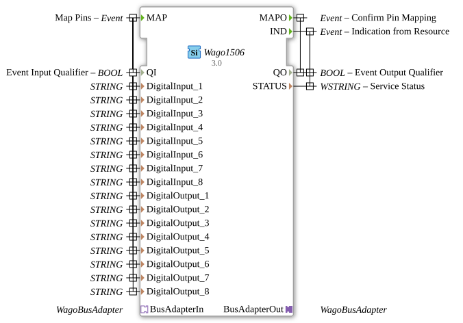

# Wago1506


* * * * * * * * * *

## Introduction
The Wago1506 is a Service Interface Function Block for controlling Wago 750-1506 I/O modules. This function block enables the configuration and control of digital inputs and outputs via a bus adapter and serves as an interface between the control logic and the physical hardware.



## Interface Structure

### **Event Inputs**

- **MAP**: Used to configure the pin assignment. Triggers the mapping of the digital inputs and outputs.

### **Event Outputs**

- **MAPO**: Confirms successful pin mapping.

- **IND**: Displays status information from the resource.

### **Data Inputs**

- **QI** (BOOL): Event Input Qualifier - Enables/disables the function block

- **DigitalInput_1** to **DigitalInput_8** (STRING): Configuration of digital inputs 1-8

- **DigitalOutput_1** to **DigitalOutput_8** (STRING): Configuration of digital outputs 1-8

### **Data Outputs**

- **QO** (BOOL): Event Output Qualifier - Operation status

- **STATUS** (WSTRING): Detailed service status information

### **Adapters**

- **BusAdapterOut** (Plug): Outgoing bus adapter for Wago communication

- **BusAdapterIn** (Socket): Incoming bus adapter for Wago communication

## Functionality
The Wago1506 FB manages communication with a Wago 750-1506 I/O module. Upon receiving the MAP event, the configured pin assignments are passed to the bus adapter interface. The function block monitors the hardware status and outputs IND events with corresponding status information when changes occur.


``` ## Technical Features
- Supports 8 digital inputs and 8 digital outputs
- Uses STRING types for pin configuration, enabling flexible addressing
- Integrates specific Wago bus adapters for reliable hardware communication
- Provides comprehensive status feedback via WSTRING

## Status Overview
1. **Inactive**: QI = FALSE, FB awaits activation
2. **Configured**: After a MAP event with successful pin assignment
3. **Active**: QI = TRUE, FB communicates with hardware
4. **Error**: In case of communication problems or invalid configurations

## Application Scenarios
- Control of Wago 750-1506 digital I/O modules
- Industrial automation applications
- Machine control with digital signals
- Process automation with distributed I/Os

## ⚖️ Comparison with Similar Function Blocks
Compared to generic I/O function blocks, the Wago1506 offers specific optimizations for Wago hardware, specifically for the 750-1506 module. The integration of dedicated bus adapters ensures more reliable communication than universal solutions.

## Conclusion
The Wago1506 function block represents a robust and specialized solution for controlling Wago 750-1506 I/O modules. Its clear separation of configuration (MAP) and operation (IND), along with comprehensive status feedback, makes it ideally suited for industrial automation projects with high reliability requirements.