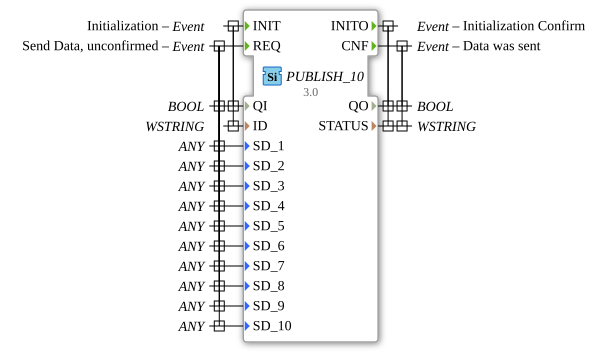

# PUBLISH_10

* * * * * * * * * *
## Introduction
The PUBLISH_10 function block is used to distribute data to one or more SUBSCRIBE_10 blocks. It enables the unacknowledged transmission of up to 10 different data values using a publish-subscribe communication pattern.
``` 

## Interface Structure

### **Event Inputs**
- **INIT**: Initialization event with associated data QI and ID
- **REQ**: Send request for unacknowledged data transmission with 10 data variables

### **Event Outputs**
- **INITO**: Acknowledgement of initialization with status information
- **CNF**: Acknowledgement that data has been sent

### **Data Inputs**
- **QI** (BOOL): Qualifier for initialization (TRUE = enable, FALSE = disable)
- **ID** (WSTRING): Identification string for the communication channel
- **SD_1** to **SD_10** (ANY): 10 different data values of any type to be sent

### **Data Outputs**
- **QO** (BOOL): Qualifier output (TRUE = successful, FALSE = failed)
- **STATUS** (WSTRING): Status information as a Unicode string

### **Adapter**
No adapter interfaces are available.

## Functionality
The PUBLISH_10 block operates according to the publish-subscribe principle. After successful initialization with the INIT event, up to 10 different data values can be distributed simultaneously to all registered subscribers via the REQ event. Data transmission is unacknowledged, meaning that the block does not expect any feedback from the recipients.

## Technical Features
- Supports up to 10 different data sources simultaneously
- Uses the generic data type ANY for maximum flexibility
- Unicode string support for ID and STATUS
- Unacknowledged communication for reduced latency
- Generic implementation via the GEN_PUBLISH base class

## State Overview
1. **Not Initialized**: Block is inactive
2. **Initialized**: Block is ready for data distribution
3. **Ready to Send**: Processes REQ events and distributes data

## Application Scenarios
- Distribution of sensor data to multiple consumers
- Broadcast communication in distributed systems
- Data distribution in real-time control systems
- Multi-consumer data pipeline architectures

## ⚖️ Comparison with Similar Blocks
Compared to acknowledged communication blocks, PUBLISH_10 offers reduced latency through unacknowledged transmission. Compared to blocks with fewer data channels, it enables the simultaneous distribution of multiple data streams.

## Conclusion

The PUBLISH_10 function block is a powerful solution for unacknowledged multi-data publish-subscribe communication in IEC 61499 systems. Its flexibility in data acquisition and support for up to 10 parallel data channels make it ideal for complex data distribution tasks in industrial automation systems.
