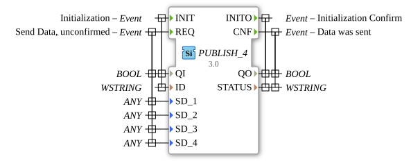

# PUBLISH_4


* * * * * * * * * *

## Introduction
The PUBLISH_4 function block is used to publish data to one or more SUBSCRIBE_4 blocks. It enables the unacknowledged transmission of up to four different data values using a publish-subscribe communication pattern.


``` 

## Interface Structure

### **Event Inputs**

- **INIT**: Initialization event with associated data QI and ID

- **REQ**: Data send request (unacknowledged) with associated data QI, SD_1, SD_2, SD_3, and SD_4

### **Event Outputs**

- **INITO**: Initialization acknowledgement with associated data QO and STATUS

- **CNF**: Data sent acknowledgement with associated data QO and STATUS

### **Data Inputs**

- **QI** (BOOL): Qualifier for initialization and send operations

- **ID** (WSTRING): Identification string for communication

- **SD_1** (ANY): First data value to be sent (any data type)

- **SD_2** (ANY): Second data value to be sent (Any data type)

- **SD_3** (ANY): Third data value to be sent (any data type)

- **SD_4** (ANY): Fourth data value to be sent (any data type)

### **Data Outputs**

- **QO** (BOOL): Qualifier for output events

- **STATUS** (WSTRING): Status information as a wide string

### **Adapters**
No adapter interfaces are available.

## Functionality
The PUBLISH_4 block initializes itself via the INIT event and confirms this with INITO. After successful initialization, up to four different data values (SD_1 to SD_4) can be sent simultaneously to all connected SUBSCRIBE_4 blocks via the REQ event. Data transmission is unacknowledged; the block only confirms that the data was sent (CNF), not that it was received.


# ## Technical Features
- Supports any data type (ANY) for all four data channels
- Uses wide strings (WSTRING) for ID and STATUS
- Unacknowledged send mode (fire-and-forget)
- Maximum capacity of four simultaneous data values
- Generic implementation as GEN_PUBLISH

## State Overview
1. **Not Initialized**: Block awaits INIT event
2. **Initialized**: Block ready to receive REQ events
3. **Send Active**: Processing REQ events and triggering CNF

## Application Scenarios
- Distributed systems with a publish-subscribe architecture
- Real-time data distribution to multiple receivers
- Systems with unidirectional data communication
- Applications requiring simultaneous transmission of multiple data values

## ⚖️ Comparison with Similar Blocks
Compared to acknowledged communication blocks, PUBLISH_4 offers lower latency due to its unacknowledged send mode. Compared to blocks with fewer data channels, it enables the simultaneous transmission of up to four different data values.

## Conclusion
The PUBLISH_4 function block is an efficient solution for unacknowledged data distribution in distributed systems. Its flexibility in supporting any data type and the ability to send four data values in parallel make it particularly suitable for complex communication scenarios in industrial automation systems.