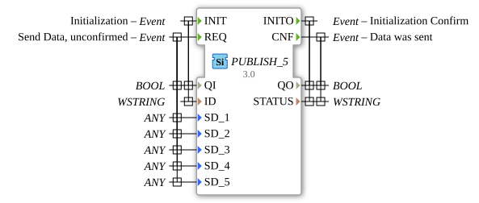

# PUBLISH_5

* * * * * * * * * *
## Introduction
The PUBLISH_5 function block is used to publish data to one or more SUBSCRIBE_5 blocks. It allows the transmission of up to five different data values using a publish-subscribe communication pattern.
``` 

## Interface Structure

### **Event Inputs**
- **INIT**: Initialization event with associated data QI and ID
- **REQ**: Request event to send data (unacknowledged) with associated data QI, SD_1 to SD_5

### **Event Outputs**
- **INITO**: Acknowledgement of initialization with associated data QO and STATUS
- **CNF**: Acknowledgement that data has been sent with associated data QO and STATUS

### **Data Inputs**
- **QI** (BOOL): Qualifier for initialization/operation
- **ID** (WSTRING): Identifier for the publish channel
- **SD_1** (ANY): First data value to be sent
- **SD_2** (ANY): Second data value to be sent
- **SD_3** (ANY): Third data value to be sent Data Value
- **SD_4** (ANY): Fourth data value to be sent
- **SD_5** (ANY): Fifth data value to be sent

### **Data Outputs**
- **QO** (BOOL): Qualifier for output status
- **STATUS** (WSTRING): Status information about the operation

### **Adapters**
No adapter interfaces are available.

## Functionality
The PUBLISH_5 block initializes itself via the INIT event and configures the publish channel with the specified ID. After successful initialization, data can be sent to all connected SUBSCRIBE_5 blocks via the REQ event. Data SD_1 to SD_5 is transmitted simultaneously. Each transmission is acknowledged by a CNF event.

## Technical Features
- Supports the ANY data type for maximum flexibility in the data to be sent
- Uses WSTRING for status messages and channel IDs
- Implements an unconfirmed sending procedure
- Provides space for up to five different data values per send

## State Overview
1. **Not Initialized**: Block waits for INIT event
2. **Initialized**: Block is ready for REQ events
3. **Send**: Processes REQ and sends data to subscriber
4. **Confirm**: Sends CNF after successful data transmission

## Application Scenarios
- Distributed systems with publisher-subscriber architecture
- Data distribution to multiple receivers in real-time systems
- Flexible messaging between different control components
- Systems with variable data structures (through ANY type support)

## ⚖️ Comparison with Similar Blocks
Compared to simpler PUBLISH blocks, PUBLISH_5 offers the Ability to send up to five different data values simultaneously. The use of the ANY data type allows for greater flexibility than type-specific publish blocks.

## Conclusion
The PUBLISH_5 function block is a powerful solution for publish-subscribe communication in distributed automation systems. Its flexibility, thanks to the ANY data type and the ability to send multiple data values simultaneously, makes it particularly suitable for complex data distribution tasks in industrial control systems.