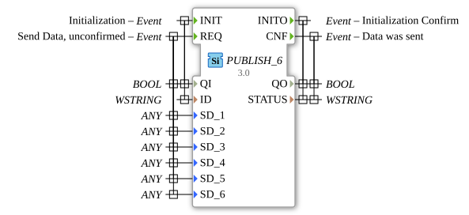

# PUBLISH_6

* * * * * * * * * *
## Introduction

The PUBLISH_6 function block is used to publish data to one or more SUBSCRIBE_6 blocks. It allows the transmission of up to six different data values via a publish-subscribe communication pattern and offers both acknowledged and unacknowledged send operations.

## Interface Structure

### **Event Inputs**

- **INIT**: Initialization event with associated data QI and ID
- **REQ**: Data transmission request (unacknowledged) with associated data QI and SD_1 to SD_6

### **Event Outputs**

- **INITO**: Initialization acknowledgment with associated data QO and STATUS
- **CNF**: Acknowledgement that data has been sent, with associated data QO and STATUS

### **Data Inputs**

- **QI** (BOOL): Quality indicator for initialization and transmission operations
- **ID** (WSTRING): Identifier for the communication channel
- **SD_1** to **SD_6** (ANY): Six different data values of any type to be sent

### **Data Outputs**

- **QO** (BOOL): Quality indicator for Output Operations
- **STATUS** (WSTRING): Status information about the executed operation

### **Adapter**

No adapter interfaces are available.

## Functionality

The PUBLISH_6 block initializes itself via the INIT event and confirms the initialization with INITO. Data can be sent via the REQ event, with up to six different data values (SD_1 to SD_6) being transmitted simultaneously. A CNF event is issued after successful data transmission. The block supports the publish-subscribe pattern, allowing multiple subscribers to receive the sent data.

## Technical Features

- Support for up to six different data values of any type (ANY)
- Use of WSTRING for status messages and channel identification
- Unacknowledged send operations (REQ) with subsequent acknowledgment (CNF)
- Generic implementation for flexible reuse

## State Overview

1. **Not Initialized**: Block waits for INIT event
2. **Initialized**: Block ready to receive REQ events
3. **Send Operation**: Processing the send request and data transmission
4. **Acknowledgement**: Output of CNF after successful transmission

## Application Scenarios

- Distribution of sensor data to multiple processing nodes
- Broadcast communication in distributed control systems
- Data distribution in production facilities with multiple consumers
- Flexible messaging in IoT applications

## ⚖️ Comparison with Similar Blocks

Compared to simpler Publish blocks, PUBLISH_6 offers the ability to simultaneously publish up to six different data values This increases efficiency when transmitting related data. The use of the ANY data type allows for maximum flexibility in the data formats to be transmitted.

## Conclusion

The PUBLISH_6 function block is a powerful tool for publish-subscribe communication in distributed automation systems. Its ability to transmit multiple data values simultaneously makes it particularly efficient for applications where related datasets need to be distributed. Flexible type support and robust error handling through status messages make it a reliable solution for industrial communication requirements.
