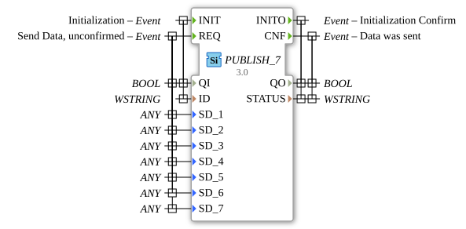

# PUBLISH_7

* * * * * * * * * *
## Introduction

The PUBLISH_7 function block is used to distribute data to one or more SUBSCRIBE_7 blocks. It enables the unacknowledged transmission of up to seven different data values via a publish-subscribe architecture.

## Interface Structure

### **Event Inputs**

- **INIT**: Initialization event with associated data QI and ID
- **REQ**: Send request for data (unacknowledged) with seven data variables

### **Event Outputs**

- **INITO**: Initialization acknowledgement with QO and STATUS
- **CNF**: Acknowledgement that data has been sent with QO and STATUS

### **Data Inputs**

- **QI** (BOOL): Quality indicator for initialization
- **ID** (WSTRING): Identifier for the publish channel
- **SD_1** to **SD_7** (ANY): Seven different data values of any type

### **Data Outputs**

- **QO** (BOOL): Quality indicator for output state
- **STATUS** (WSTRING): Status information as a Unicode string

### **Adapter**

No adapter interfaces available.

## Functionality

The PUBLISH_7 block initializes itself via the INIT event with a specific channel ID. After successful initialization, up to seven data values (SD_1 to SD_7) can be distributed simultaneously to all connected SUBSCRIBE_7 blocks via the REQ event. Data transmission is unacknowledged; the CNF output only confirms that the data was sent, not that it was received.

## Technical Features

- Supports the ANY data type for maximum flexibility
- Uses WSTRING for ID and STATUS for international character set support
- Provides seven independent data channels
- Implemented according to the IEC 61499-2 standard
- Uses GenericClassName 'GEN_PUBLISH' for generic implementation

## State Overview

1. **Not Initialized**: Block awaits INIT event
2. **Initialized**: Block ready for REQ events
3. **Ready to Send**: Processes REQ events and distributes data

## Application Scenarios

- Distribution of sensor data to multiple consumers
- Broadcast communication in distributed systems
- Data distribution in production facilities
- Measurement distribution in monitoring systems

## ⚖️ Comparison with Similar Blocks

Compared to simpler PUBLISH blocks, PUBLISH_7 offers the ability to distribute seven different data values in parallel, while simpler variants typically support only one or a few data channels.

## Conclusion

The PUBLISH_7 function block is a powerful solution for publish-subscribe communication in IEC 61499 systems, which, thanks to its seven parallel data channels and flexibility in data types, is particularly suitable for complex data distribution tasks.
