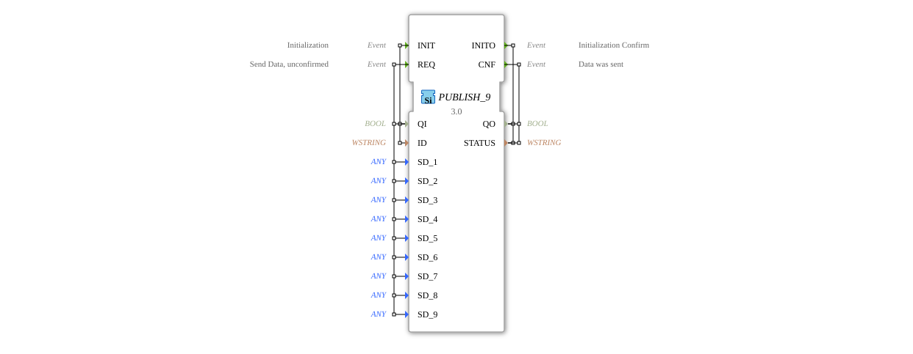

# PUBLISH_9

* * * * * * * * * *
## Introduction

The PUBLISH_9 function block is used to publish data to one or more SUBSCRIBE_9 blocks. It enables the unacknowledged transmission of up to nine different data values over a communication network.

## Interface Structure

### **Event Inputs**

- **INIT**: Initialization event with associated data QI and ID
- **REQ**: Send request for unacknowledged data transmission with nine data values

### **Event Outputs**

- **INITO**: Initialization acknowledgment with QO and STATUS
- **CNF**: Acknowledgement that data has been sent, with QO and STATUS

### **Data Inputs**

- **QI** (BOOL): Qualifier for initialization (TRUE = enable, FALSE = disable)
- **ID** (WSTRING): Identifier for the communication channel
- **SD_1** to **SD_9** (ANY): Nine different data values of any type to be sent

### **Data Outputs**

- **QO** (BOOL): Qualifier for output state
- **STATUS** (WSTRING): Status information about the operating state

### **Adapter**

No adapter interfaces are available.

## Functionality

The PUBLISH_9 block is first initialized via the INIT event, where the ID parameter defines the communication channel. With the QI input enabled (TRUE), data can be sent via the REQ event. The block transmits all nine SD_x data values simultaneously to all connected SUBSCRIBE_9 blocks. The transmission is unacknowledged, but the CNF event signals successful processing of the send request.

## Technical Features

- Supports up to nine different data values of any type (ANY)
- Unacknowledged communication (fire-and-forget principle)
- WSTRING-based channel identification for flexible addressing
- Generic implementation via the GEN_PUBLISH base class

## State Overview

The block has two main states: initialized and uninitialized. After successful initialization (INIT with QI=TRUE), the block switches to the active state and can send data. Upon deactivation (INIT with QI=FALSE), the block is deinitialized.

## Application Scenarios

- Distributed systems with publisher-subscriber architecture
- Data exchange between different control components
- Broadcast communication in automation networks
- Systems with one-to-many communication relationships

## ⚖️ Comparison with similar blocks

Compared to acknowledged communication blocks, PUBLISH_9 offers reduced latency by eliminating the need for acknowledgments. Compared to blocks with fewer data channels, it enables the simultaneous transmission of multiple data values, thus increasing system efficiency.

## Conclusion

The PUBLISH_9 function block is a powerful solution for unacknowledged multiple data transmissions in distributed automation systems. Its data transmission flexibility and support for nine different data values make it ideal for complex communication scenarios in industrial control systems.