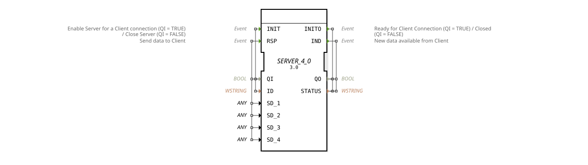

# SERVER_4_0

* * * * * * * * * *

## Introduction

The `SERVER_4_0` function block is the generic server variant with 4 send and 0 receive data fields for communicating with a matching [CLIENT_0_4](CLIENT_0_4.md) block. It transmits 4 data values (`SD_1` `SD_2` `SD_3` `SD_4`) to the client without receiving any data back. Like all `SERVER_*` blocks, it is based on the generic `GEN_SERVER` implementation — the same C++ base as [CLIENT_1](CLIENT_1.md)/[SERVER_1](SERVER_1.md); only the number of send/receive fields differs per instantiation.

## Interface Structure

### **Event Inputs**

- **INIT**: Enables the server for a client connection (QI = TRUE) or closes it (QI = FALSE), carries `QI` and `ID`.
- **RSP**: Sends data to the client, carries `QI` and `SD_1` `SD_2` `SD_3` `SD_4`.

### **Event Outputs**

- **INITO**: Confirms connection setup/teardown, carries `QO` and `STATUS`.
- **IND**: Signals that new data is available from the client, carries `QO`, `STATUS`.

### **Data Inputs**

- **QI** (BOOL): Controls the connection state (`TRUE` = open connection, `FALSE` = close connection).
- **ID** (WSTRING): Connection identifier (e.g. target address/port).
- **SD_1** (ANY): Send value 1, transmitted to the client with `RSP`.
- **SD_2** (ANY): Send value 2, transmitted to the client with `RSP`.
- **SD_3** (ANY): Send value 3, transmitted to the client with `RSP`.
- **SD_4** (ANY): Send value 4, transmitted to the client with `RSP`.

### **Data Outputs**

- **QO** (BOOL): Current connection status.
- **STATUS** (WSTRING): Status information about the connection.
- No receive fields (`SERVER_4_0` receives no payload data via `IND`, only connection/status information).

## Functionality

`SERVER_4_0` initializes a connection to the matching `CLIENT_0_4` block via `INIT` (when `QI = TRUE`) or closes it (when `QI = FALSE`); completion is confirmed via `INITO`. Via `RSP`, the values `SD_1` `SD_2` `SD_3` `SD_4` are transmitted to the client. Once a response is available, the block triggers `IND`.

## Technical Features

- **Generic implementation**: `eclipse4diac::core::GenericClassName = 'GEN_SERVER'`, the same C++ base as all other `SERVER_*` variants; the number and type (`ANY`) of send/receive fields are fixed per instantiation via the type definition.
- **`ANY` data fields**: All `SD_i`/`RD_i` are generically (`ANY`) typed and adapt to whichever data type is wired to them.
- **Counterpart `CLIENT_0_4`**: `SERVER_4_0` is only functionally compatible with a `CLIENT_0_4` block on the client side — the number of send fields on one side must match the number of receive fields on the other.

## State Overview

1. **Disconnected**: Initial state, `QO = FALSE`.
2. **Connecting**: `INIT` with `QI = TRUE` is processed.
3. **Connected**: `INITO` with `QO = TRUE` confirms the connection.
4. **Data exchange**: `RSP`/`IND` cycle for send/receive data.
5. **Disconnecting**: `INIT` with `QI = FALSE` is processed.

## Application Scenarios

- **Communication between distributed control systems** that need to send exactly 4 values and receive exactly 0 values, without carrying unused surplus data fields.
- **Server-side connection** to a communication partner already laid out as a `CLIENT_0_4` with the matching field count.

## Comparison with similar function blocks

- **[CLIENT_0_4](CLIENT_0_4.md)**: the direct counterpart on the client side, with send/receive field counts swapped.
- **[CLIENT_1](CLIENT_1.md) / [SERVER_1](SERVER_1.md)**: the same generic implementation with one send and one receive field each.

## Conclusion

`SERVER_4_0` provides the generic server variant of the `GEN_SERVER` family tailored to 4 send and 0 receive fields, suiting network connections whose payload count differs from the standard single-field variant.
