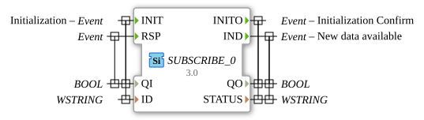

# SUBSCRIBE_0


* * * * * * * * * *

## Introduction
The SUBSCRIBE_0 function block is used to subscribe to data from a PUBLISH_0 block. It enables communication between different components in a distributed automation system by receiving data from a publisher and triggering events when new data is available.


``` 

## Interface Structure

### **Event Inputs**
- **INIT** (Type: EInit) - Initialization Event

- Linked to: QI, ID

- **RSP** (Type: Event) - Response Event

- Linked to: QI

### **Event Outputs**
- **INITO** (Type: EInit) - Initialization Confirmation

- Linked to: QO, STATUS

- **IND** (Type: Event) - Indication of New Available Data

- Linked to: QO, STATUS

### **Data Inputs**

- **QI** (Type: BOOL) - Qualifier for Initialization

- **ID** (Type: WSTRING) - Subscription Connection Identifier

### **Data Outputs**

- **QO** (Type: BOOL) - Qualifier for Initial State

- **STATUS** (Type: WSTRING) - Status Information

### **Adapter**
No adapter interfaces are present.

## Functionality
The SUBSCRIBE_0 block initializes itself via the INIT event and establishes a connection to a PUBLISH_0 block, which is identified by the ID parameter. After successful initialization, the block confirms this via the INITO event. When new data is received from the publisher, the IND event is triggered, informing the application about available data.


## Technical Features
- Uses WSTRING data types for ID and STATUS for international character support
- Implements a qualification model with QI and QO for state management
- Provides status feedback via the STATUS output

## State Overview
1. **Not Initialized**: Initial state before INIT
2. **Initialization Phase**: During INIT processing
3. **Ready**: Successfully initialized and waiting for data
4. **Data Receiving**: Processes incoming data and triggers IND

## Application Scenarios
- Distributed automation systems with data distribution
- IoT applications with a publisher-subscriber pattern
- Monitoring systems that collect status data from various sources
- Control systems with decoupled communication between components

## ⚖️ Comparison with Similar Blocks
Compared to other communication blocks, SUBSCRIBE_0 focuses specifically on the publisher-subscriber pattern and provides a simple interface for subscribing to data streams. Unlike client-server modules, it operates asynchronously and is push-based.

## Conclusion
The SUBSCRIBE_0 function block offers a robust solution for subscribing to data in distributed automation systems. Its clear interface and established publisher-subscriber pattern make it a reliable choice for loosely coupled communication scenarios.