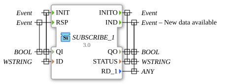

# SUBSCRIBE_1

* * * * * * * * * *
## Introduction

The SUBSCRIBE_1 function block is used to subscribe to data from a PUBLISH_1 block. It enables communication between different components in a distributed system by receiving data from a publisher and making it available when new data is available.
`` 

## Interface Structure

### **Event Inputs**

- **INIT**: Initialization event with associated data QI and ID
- **RSP**: Response event with associated data QI

### **Event Outputs**

- **INITO**: Initialization output with associated data QO and STATUS
- **IND**: Indication event when new data is available with associated data QO, STATUS, and RD_1

### **Data Inputs**

- **QI** (BOOL): Qualifier Input - Controls block activation
- **ID** (WSTRING): Identifier - Unique ID for the subscription connection

### **Data Outputs**

- **QO** (BOOL): Qualifier Output - Block execution status
- **STATUS** (WSTRING): Status information as Unicode String
- **RD_1** (ANY): Received Data - Can contain any data type

### **Adapter**

No adapter interfaces are available.

## Functionality

The SUBSCRIBE_1 block initializes itself via the INIT event and subscribes to data from a PUBLISH_1 block with the specified ID. Upon successful initialization, it confirms this via INITO. When new data is available from the publisher, the IND event is triggered, and the received data is made available via RD_1. The STATUS output provides status information about the subscription process.

## Technical Features

- Uses WSTRING for ID and STATUS for Unicode compatibility
- RD_1 supports the ANY data type for maximum flexibility in received data
- Two separate event paths for initialization and data reception
- Qualifier inputs (QI) and outputs (QO) for reliable state control

## State Overview

1. **Not Initialized**: Block waits for INIT event
2. **Initialized**: Subscription active, waits for data from the publisher
3. **Data Reception**: Processes incoming data and triggers IND event

## Application Scenarios

- Distributed control systems with data distribution
- IoT applications with publisher-subscriber architecture
- Industry 4.0 communication structures
- Real-time data exchange between different control components

## ⚖️ Comparison with Similar Blocks

Compared to other communication blocks, SUBSCRIBE_1 offers a specialized solution for the publisher-subscriber pattern with a focus on Flexibility is enhanced by the ANY data type and Unicode support.

## Conclusion

The SUBSCRIBE_1 function block is an essential building block for distributed systems in 4diac, enabling robust and flexible communication between different components. Its simple interface and support for any data type make it versatile for use in various automation applications.

---

### 🌐 Related topic subpages on ms-muc-docs.de

* [🌐 Eclipse 4diac IDE & Color Reference on ms-muc-docs.de](https://www.ms-muc-docs.de/iec-61499/eclipse-4diac/)

]
