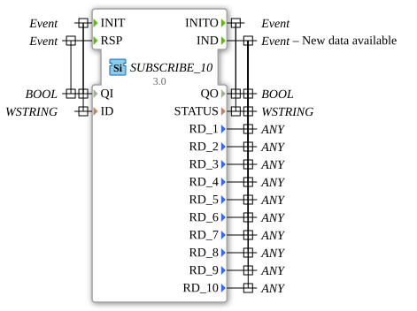

# SUBSCRIBE_10

* * * * * * * * * *
## Introduction
The SUBSCRIBE_10 function block acts as a subscriber in a publish-subscribe communication pattern and allows data to be received from a PUBLISH_10 block. The block can receive and process up to 10 different data values simultaneously.

## Interface Structure

### **Event Inputs**

- **INIT** (Type: EInit) - Initialization Event

- Linked to: QI, ID

- **RSP** (Type: Event) - Response Event

- Linked to: QI

### **Event Outputs**

- **INITO** (Type: EInit) - Initialization Output

- Linked to: QO, STATUS

- **IND** (Type: Event) - Indication Event (New Data Available)

- Linked to: QO, STATUS, RD_1 to RD_10

### **Data Inputs**

- **QI** (BOOL) - Qualified Input (Activation)

- **ID** (WSTRING) - Identification String for the Connection

### **Data Outputs**

- **QO** (BOOL) - Qualified Output (Status)

- **STATUS** (WSTRING) - Status Information

- **RD_1** to **RD_10** (ANY) - Received Data Values 1-10

### **Adapter**
No adapter interfaces available.

## Functionality
The SUBSCRIBE_10 block initializes via the INIT event and connects to a corresponding PUBLISH_10 block based on the specified ID. As soon as new data is available from the publisher, the IND event is triggered, and the received data is made available via the RD_1 to RD_10 outputs.

## Technical Features
- Supports the ANY data type for all received data, offering maximum flexibility in data types
- Can receive up to 10 different data values in parallel
- Uses WSTRING for status and identification information
- Implements a reliable publish-subscribe communication pattern

## State Overview
1. **Not Initialized**: Block is inactive
2. **Initialized**: Connection to the publisher established, waiting for data
3. **Data Receiving**: Receives and processes incoming data
4. **Error State**: In case of connection problems or errors

## Application Scenarios
- Distributed control systems
- Data distribution in automation networks
- Communication between different control components
- Monitoring systems with multiple data sources

## ⚖️ Comparison with Similar Blocks
Compared to simpler subscribe blocks, SUBSCRIBE_10 offers the ability to receive up to 10 different data values simultaneously, making it suitable for more complex applications with multiple data points.

## Conclusion

The SUBSCRIBE_10 function block is a powerful tool for distributed communication in IEC 61499 systems. Its ability to process up to 10 different data values and its flexible ANY data type support make it particularly suitable for complex automation applications with extensive data exchange requirements.