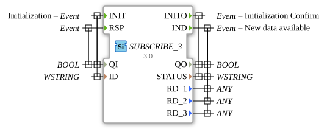

# SUBSCRIBE_3

* * * * * * * * * *
## Introduction
The SUBSCRIBE_3 function block is used to subscribe to data from a PUBLISH_3 block. It enables the reception of three different data streams over a network connection and provides a standardized mechanism for communication between distributed system components.
`` 

## Interface Structure

### **Event Inputs**
- **INIT**: Initialization event with associated data QI and ID
- **RSP**: Response event with associated data QI

### **Event Outputs**
- **INITO**: Initialization confirmation with associated data QO and STATUS
- **IND**: Data availability event with associated data QO, STATUS, RD_1, RD_3, and RD_2

### **Data Inputs**
- **QI** (BOOL): Qualifier for initialization and operation
- **ID** (WSTRING): Identification string for the connection

### **Data Outputs**
- **QO** (BOOL): Qualifier for output state
- **STATUS** (WSTRING): Connection status information
- **RD_1** (ANY): Received data type 1
- **RD_2** (ANY): Received data type 2
- **RD_3** (ANY): Received data type 3

### **Adapter**
No adapter interfaces available.

## Functionality
The SUBSCRIBE_3 block initializes itself via the INIT event and establishes a connection to a corresponding PUBLISH_3 block. After successful initialization, it confirms this via INITO. When data is received from the publisher, the IND event is triggered, and the received data is output via RD_1, RD_2, and RD_3. The STATUS parameter provides information about the connection status.

```
## Technical Features
- Supports three independent data channels (RD_1, RD_2, RD_3) with ANY data type
- Uses WSTRING for ID and STATUS for international character support
- Implements a reliable initialization protocol with QI/QO handshake
- Generic implementation via the GEN_SUBSCRIBE base class

## State Overview
1. **Not Initialized**: Block waits for INIT event

2. **Initialization**: Processing INIT with ID parameter
3. **Ready**: Successful connection to the publisher
4. **Data Receiving**: Processing incoming data with IND trigger

## Application Scenarios
- Distributed control systems in automation technology
- Data distribution in IoT applications
- Communication between different control levels
- Machine-to-machine communication in Industry 4.0 environments

## ⚖️ Comparison with Similar Blocks
Compared to simpler SUBSCRIBE blocks, this offers SUBSCRIBE_3 offers the ability to receive three different data streams in parallel. The use of ANY data types allows for greater flexibility in the transmitted data formats.

## Conclusion
The SUBSCRIBE_3 function block represents a powerful solution for communication in distributed automation systems. Its support for multiple data channels and flexible data types makes it particularly suitable for complex applications where multiple data sources need to be monitored simultaneously.
