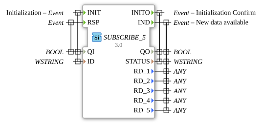

# SUBSCRIBE_5

* * * * * * * * * *
## Introduction
The SUBSCRIBE_5 function block is used to subscribe to data from a PUBLISH_5 block. It allows the reception of up to five different data points over a network connection and provides a standardized interface for communication between distributed automation components.


## Interface Structure

### **Event Inputs**
- **INIT**: Initialization event with the associated data QI and ID
- **RSP**: Response event with the associated data point QI

### **Event Outputs**
- **INITO**: Initialization confirmation with the data QO and STATUS
- **IND**: Indication event when new data is available with QO, STATUS, and the five data points RD_1 to RD_5

### **Data Inputs**
- **QI** (BOOL): Qualifier for initialization - activates/deactivates the block
- **ID** (WSTRING): Identification string for assignment to the corresponding PUBLISH_5 block

### **Data Outputs**
- **QO** (BOOL): Qualifier output - indicates the operating status
- **STATUS** (WSTRING): Status Information and Error Messages
- **RD_1** to **RD_5** (ANY): Received data points 1 to 5 with any data type

### **Adapter**
No adapter interfaces are available.

## Functionality
The SUBSCRIBE_5 block initializes itself via the INIT event and then establishes a connection to the corresponding PUBLISH_5 block. Upon successful initialization, it confirms this via INITO. As soon as new data is available from the publisher, it is output via the IND event using the corresponding data outputs RD_1 to RD_5. The STATUS output provides information about the connection status and any errors.

``` ## Technical Features
- Supports up to five different data points simultaneously
- Uses WSTRING for ID and STATUS for international character set support
- ANY type for data outputs enables flexible data types
- Generic implementation via the GEN_SUBSCRIBE base class

## State Overview
1. **Not Initialized**: Block waits for INIT event
2. **Initialization Phase**: Processing INIT with ID parameter
3. **Connected**: Successful connection to the publisher, ready to receive data
4. **Data Reception**: Processing incoming data and output via IND

## Application Scenarios
- Distributed automation systems
- Data distribution in production plants
- Machine-to-machine communication
- Monitoring systems with multiple sensor data
- SCADA systems with decentralized data sources

## ⚖️ Comparison with Similar Blocks
Compared to simpler SUBSCRIBE blocks, SUBSCRIBE_5 offers the ability to process up to five different data points in parallel. received. The use of ANY types makes it more flexible than type-specific subscribe blocks, but requires a correct type mapping to the corresponding publisher.

## Conclusion
The SUBSCRIBE_5 function block represents a powerful and flexible solution for receiving multiple data streams in distributed automation systems. Its generic implementation and support for various data types make it particularly suitable for complex applications with variable data structures.