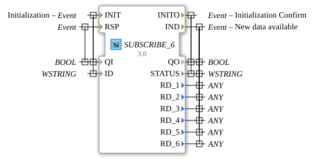

# SUBSCRIBE_6

* * * * * * * * * *
## Introduction

The SUBSCRIBE_6 function block is used to subscribe to data from a PUBLISH_6 block. It allows the receipt of up to six different data values via a network connection and makes them available for further processing in an IEC 61499 system.

## Interface Structure

### **Event Inputs**

- **INIT**: Initialization event with associated data QI and ID
- **RSP**: Response event with associated data QI

### **Event Outputs**

- **INITO**: Initialization confirmation with associated data QO and STATUS
- **IND**: Indication event for newly available data with associated data QO, STATUS, and RD_1 to RD_6

### **Data Inputs**

- **QI** (BOOL): Qualifier Input - Controls block activation
- **ID** (WSTRING): Identification string for assignment to the corresponding PUBLISH_6 block

### **Data Outputs**

- **QO** (BOOL): Qualifier Output - Block operation status
- **STATUS** (WSTRING): Status information as a Unicode string
- **RD_1** to **RD_6** (ANY): Received data values (up to 6 different data types)

## Functionality

The SUBSCRIBE_6 block initializes itself via the INIT event and establishes a connection to a PUBLISH_6 block with the specified ID. Upon successful initialization, it confirms this with INITO. As soon as new data is available from the PUBLISH_6 block, the SUBSCRIBE_6 block triggers the IND event and makes the received data available via the RD_1 to RD_6 outputs.

## Technical Features

- Supports up to six different data values simultaneously
- Uses WSTRING for status messages and identification
- Flexible data types through ANY type for received data
- Network-based communication between distributed systems

## State Overview

The block goes through the following main states:

1. **Not Initialized**: Block is inactive
2. **Initialization**: Processing the INIT event
3. **Connected**: Successful connection to the publisher
4. **Data Reception**: Receives and processes incoming data

## Application Scenarios

- Distributed control systems with data distribution
- Monitoring systems with centralized data acquisition
- Industry 4.0 applications with machine data
- SCADA systems with decentralized data sources

## ⚖️ Comparison with Similar Blocks

Compared to simpler Subscribe blocks, SUBSCRIBE_6 offers the ability to receive up to six different data values in parallel, enabling higher data throughput capacity. Using WSTRING for status messages allows for more detailed error information.

## Conclusion

The SUBSCRIBE_6 function block is a powerful solution for distributed systems that require the simultaneous reception of multiple data streams. Its flexible architecture and support for various data types make it ideal for complex industrial automation applications.
