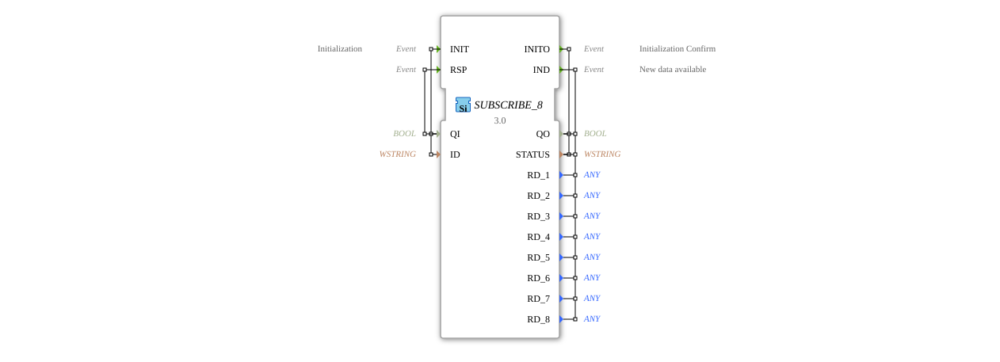

# SUBSCRIBE_8


* * * * * * * * * *

## Introduction
The SUBSCRIBE_8 function block acts as a subscriber for a PUBLISH_8 block and allows the receipt of up to 8 different data values over a single communication link. The block implements a publish-subscribe communication pattern and is part of the iec61499::net package.


``` 

## Interface Structure

### **Event Inputs**

- **INIT** - Initialization Event

- Linked to: QI, ID

- **RSP** - Response Event

- Linked to: QI

### **Event Outputs**

- **INITO** - Initialization Confirmation

- Linked to: QO, STATUS

- **IND** - Indication Event for New Data

- Linked to: QO, STATUS, RD_1 to RD_8

### **Data Inputs**

- **QI** (BOOL) - Qualified Input for Initialization

- **ID** (WSTRING) - Identification String for the Connection

### **Data Outputs**

- **QO** (BOOL) - Qualified Output

- **STATUS** (WSTRING) - Status Information
- **RD_1** to **RD_8** (ANY) - Received Data Values 1 to 8

### **Adapter**
No adapter interfaces available.

## Functionality
The SUBSCRIBE_8 block initializes itself via the INIT event and establishes a connection to a corresponding PUBLISH_8 block. After successful initialization, it confirms this with the INITO event. When data is received from the publisher, the IND event is triggered, and the received data is made available via the RD_1 to RD_8 outputs.


## Technical Features
- Supports the ANY data type for all data outputs, enabling maximum flexibility in the transmitted data types
- Uses WSTRING for status messages and identification
- Implements a reliable initialization protocol with qualification bits
- Can receive up to 8 different data values in parallel

## State Overview
1. **Not Initialized** - Block waiting for INIT event
2. **Initialization** - Processing the INIT event
3. **Ready** - Successfully initialized, waiting for data
4. **Data Receiving** - Processing incoming data with IND triggering

## Application Scenarios
- Distributed control systems with data distribution
- Monitoring systems with centralized data acquisition
- Communication between different control components
- Systems with a publish-subscribe architecture

## ⚖️ Comparison with Similar Blocks
Compared to simpler subscribe blocks, SUBSCRIBE_8 offers the ability to receive up to 8 different data values in parallel. Using the ANY data type offers greater flexibility than type-specific subscribe blocks.

## Conclusion
The SUBSCRIBE_8 function block provides a powerful and flexible solution for publish-subscribe communication in distributed automation systems. Its ability to receive multiple data values of different types makes it particularly suitable for complex communication scenarios in industrial control systems.