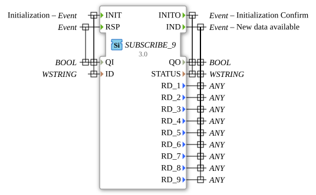

# SUBSCRIBE_9

* * * * * * * * * *
## Introduction
The SUBSCRIBE_9 function block is used to subscribe to data from a PUBLISH_9 block. It allows the receipt of up to 9 different data points via a network connection and makes them available for further processing in the control system.

* * * * * * * * *

The SUBSCRIBE_9 function block is used to subscribe to data from a PUBLISH_9 block. It enables the reception of up to 9 different data points via a network connection and makes them available for further processing in the control system.

`` 

## Interface Structure

### **Event Inputs**
- **INIT**: Initialization event with associated data QI and ID
- **RSP**: Response event with associated data QI

### **Event Outputs**
- **INITO**: Initialization confirmation with QO and STATUS
- **IND**: Indication event when new data is available with QO, STATUS, and all 9 RD_x data outputs

### **Data Inputs**
- **QI** (BOOL): Qualifier for initialization (TRUE = enable, FALSE = disable)
- **ID** (WSTRING): Identification string for the connection to the publisher

### **Data Outputs**
- **QO** (BOOL): Qualifier output for operating status
- **STATUS** (WSTRING): Status information as Unicode String
- **RD_1** to **RD_9** (ANY): Received data points 1-9 with any data type

### **Adapter**
No adapter interfaces available.

## Functionality
Upon receiving the INIT event, the SUBSCRIBE_9 block initializes a connection to a PUBLISH_9 block based on the specified ID. After successful initialization, it confirms this with the INITO event. When data is received from the publisher, the IND event is triggered, and the data is made available via the RD_1 to RD_9 outputs.

## Technical Features
- Supports up to 9 different data points in parallel
- Uses WSTRING for status and identification information
- ANY data types for the received data enable flexible data types
- Generic implementation as GEN_SUBSCRIBE

## State Overview
1. **Not Initialized**: Block waits for INIT event

2. **Initialized**: Connection to the publisher established, ready to receive data
3. **Data Receiving**: Processes incoming data and triggers IND event

## Application Scenarios
- Distributed control systems with data distribution
- Machine networking in Industry 4.0 environments
- Monitoring systems with centralized data collection
- Systems with multiple decentralized sensor nodes

## ⚖️ Comparison with Similar Blocks
Compared to simpler SUBSCRIBE blocks, SUBSCRIBE_9 offers the ability to receive up to 9 different data points simultaneously, increasing efficiency in more complex network structures.

## Conclusion

The SUBSCRIBE_9 function block is a powerful solution for receiving multiple data streams in distributed automation systems and is particularly suitable for applications with high data throughput.
