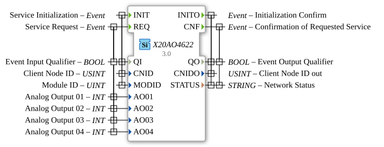

# X20AO4622

* * * * * * * * * *
## Introduction

The X20AO4622 function block is used to control analog outputs via the openPOWERLINK fieldbus. It corresponds to the B&R X20AO4622 module (4 outputs).

## Interface Structure

### **Event Inputs**

- **INIT**: Initialization.
- **REQ**: Writes the values of the inputs `AOxx` to the module.

### **Event Outputs**

- **INITO**: Initialization confirmed.
- **CNF**: Write operation confirmed.

### **Data Inputs**

- **QI** (BOOL): Qualifier.
- **CNID** (USINT): Client Node ID.
- **MODID** (UINT): Module ID.
- **AO01** (INT): Analog value for output 01.
- **AO02** (INT): Analog value for output 02.
- **AO03** (INT): Analog value for output 03.
- **AO04** (INT): Analog value for output 04.

### **Data Outputs**

- **QO** (BOOL): Qualifier.
- **CNIDO** (USINT): Confirmed Node ID.
- **STATUS** (STRING): Status.

## Functionality

The integer values present at inputs `AO01`-`AO04` are sent to the output module when the `REQ` event is triggered.

## Metadata

| Attribute | Value |
| :--- | :--- |
| Copyright | (c) 2011 AIT |
| License | EPL-2.0 |
| Version | 3.0 (2025-04-14, Patrick Aigner) |
| 4diac Package | powerlink |

---

### 🌐 Related topic subpages on ms-muc-docs.de

* [🌐 Eclipse 4diac IDE & Color Reference on ms-muc-docs.de](https://www.ms-muc-docs.de/iec-61499/eclipse-4diac/)

]